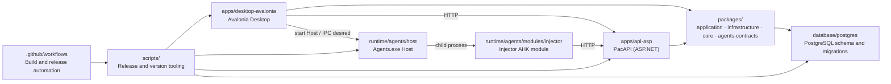

# PacToolkits

<div align="center">

[English](./README.md) | [简体中文](./README.zh-CN.md)

<br />

<table>
  <tr>
    <td align="center" width="260" valign="top">
      
      <br />
      <strong>PacToolkits Desktop</strong>
      <br />
      <sub>Avalonia Desktop Client</sub>
      <br />
      <sub>&nbsp;</sub>
      <br />
      
      <br />
      
    </td>
    <td align="center" width="260" valign="top">
      
      <br />
      <strong>PacToolkits Agents</strong>
      <br />
      <sub>Host and modules runtime</sub>
      <br />
      <sub>&nbsp;</sub>
      <br />
      
      <br />
      
    </td>
  </tr>
</table>

<br />

<sub><strong>Desktop</strong> for business work · <strong>Agents</strong> for automation · <strong>DB</strong> for tasks and durable state</sub>

<br />
<br />

**Drug trace-code tools: desktop, automation, and PostgreSQL**

PacToolkits Desktop, PacAPI, Agents (Host and modules), and PostgreSQL for drug trace-code operations.

</div>

---

## Project Overview

**PacToolkits** is a monorepo for drug trace-code work:

- PacToolkits Desktop for business workflows and diagnostics
- PacAPI (ASP.NET HTTP host)
- Agents runtime: a .NET **Host** (`Agents.exe`) and separately supervised automation **Modules**
- PostgreSQL schema and migrations for intake, mapping, tasks, and execution state

Main areas:

- business UI in [`apps/desktop-avalonia`](./apps/desktop-avalonia/)
- HTTP host in [`apps/api-asp`](./apps/api-asp/)
- shared use cases in `packages/application`
- PostgreSQL implementations in `packages/infrastructure`
- Agents Host and modules in [`runtime/agents`](./runtime/agents/)
- schema evolution in [`database/postgres`](./database/postgres/)

---

## Highlights

- Desktop, Agents, and DB live in one repository
- Avalonia business client with update and diagnostics
- Resident .NET Host supervises modules and publishes Snapshot; Desktop owns Host lifecycle and session desired
- PostgreSQL migrations with schema compatibility checks
- Versioned release pipeline for Desktop, Agents, and DB schema ranges
- Operational views for inventory, mapping, MSFX linkage, and execution queues

---

## Architecture



---

## Repository Map

```text
pactoolkits/
  apps/desktop-avalonia/      Desktop client (Avalonia)
  apps/api-asp/               HTTP host (PacToolkits.Api)
  packages/
    core/                     Pure domain helpers (no IO)
    application/              Use cases, DTOs, service abstractions
    infrastructure/           PostgreSQL repos and DB services
    agents-contracts/         Shared Desktop and Agents protocol
  runtime/agents/             Agents runtime (Host and modules)
  database/postgres/          PostgreSQL bootstrap, migration, verify, deploy
  docs/                       Architecture and operations docs
  scripts/                    Versioning, packaging, release helpers
  .github/workflows/          CI/CD and release workflows
  PacToolkits.sln             .NET solution entry point
  release-manifest.json       Version and compatibility manifest
```

---

## Documentation

### Cross-cutting

- [Monorepo layout](./docs/architecture/monorepo-layout.md)
- [Layering and dependency rules](./docs/architecture/layering.md)
- [Agents runtime architecture](./docs/architecture/agents.md)
- [API host](./docs/architecture/api.md)
- [Desktop UI state model](./docs/architecture/desktop-state.md)
- [Release flow](./docs/operations/release-flow.md)
- [Beta release policy](./docs/operations/beta-release-policy.md)
- [Database compatibility policy](./docs/operations/database-compatibility-policy.md)

### Modules

- [Desktop](./apps/desktop-avalonia/README.md) · [overview](./apps/desktop-avalonia/docs/overview.md)
- [API](./apps/api-asp/README.md)
- [Agents](./runtime/agents/README.md) · [Injector](./runtime/agents/docs/injector.md)
- [PostgreSQL](./database/postgres/README.md) · [overview](./database/postgres/docs/overview.md)
- [Scripts tooling](./scripts/docs/tooling.md)

---

## Domain Coverage

- drug trace-code intake
- trace-code entry and verification
- inventory overview and low-stock workflows
- drug information maintenance
- client alias management
- MSFX linkage, bill-watch recovery, and audit
- warehouse task injection, reopen, and discard handling
- runtime and Agents configuration management

---

## Versioning

Versions and compatibility ranges live in [`release-manifest.json`](./release-manifest.json) (schema v2).

```bash
./scripts/check-version.sh
./scripts/export-version.sh
```

Release, packaging, and channel policy: [Release flow](./docs/operations/release-flow.md).

---

## Getting Started

**Prerequisites:** .NET SDK 10.x, `psql`, `bash`, `jq`, and `zip`. Velopack packaging also requires `vpk`.

```bash
dotnet build PacToolkits.sln
```

- Desktop: see [apps/desktop-avalonia/README.md](./apps/desktop-avalonia/README.md)
- API: see [apps/api-asp/README.md](./apps/api-asp/README.md)
- Agents: see [runtime/agents/README.md](./runtime/agents/README.md)
- Database: see [database/postgres/README.md](./database/postgres/README.md)

---

## Design Principles

- Versioning follows a single release manifest
- Desktop, PacAPI, Agents, and DB advance together under published ranges
- Business flows stay observable (logs, status, queues)
- Automation is configured, not hard-coded into UI pages
- Task and execution state live in the database
- Desktop, runtime, and persistence boundaries stay explicit

---

## JetBrains Support

This project is developed with support from the **JetBrains Open Source Support Program**.

Thanks to JetBrains for supporting the project:

- [JetBrains Open Source Support](https://www.jetbrains.com/opensource/)

---

## License

Released under the [GNU General Public License version 3 or later](./LICENSE) (`GPL-3.0-or-later`).
This project is free software; see the license file for copying conditions.
