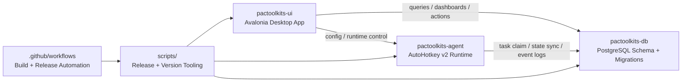

# PacToolkits

<div align="center">

[English](./README.md) | [简体中文](./README.zh-CN.md)

<br />

<table>
  <tr>
    <td align="center" width="260" valign="top">
      
      <br />
      <strong>PacToolkits UI</strong>
      <br />
      <sub>Avalonia Desktop Client</sub>
      <br />
      <sub>&nbsp;</sub>
      <br />
      
      <br />
      
    </td>
    <td align="center" width="260" valign="top">
      
      <br />
      <strong>PacToolkits Agent</strong>
      <br />
      <sub>AutoHotkey Automation Runtime</sub>
      <br />
      <sub>&nbsp;</sub>
      <br />
      
      <br />
      
    </td>
  </tr>
</table>

<br />

<sub><strong>UI</strong> for business operations · <strong>Agent</strong> for automation execution · <strong>DB</strong> for task orchestration and persistence</sub>

<br />
<br />

**Drug Trace-Code Operations Suite for UI, Automation, and Database Workflows**

Desktop UI, AutoHotkey automation, and PostgreSQL orchestration for drug trace-code operations.

<br />

<table>
  <tr>
    <td align="center"><a href="./LICENSE"></a></td>
    <td align="center"><a href="https://www.jetbrains.com/opensource/"></a></td>
    <td align="center"></td>
    <td align="center"></td>
  </tr>
  <tr>
    <td align="center"><a href="./pactoolkits-ui"></a></td>
    <td align="center"><a href="./pactoolkits-agent"></a></td>
    <td align="center"><a href="./pactoolkits-db"></a></td>
    <td align="center"></td>
  </tr>
  <tr>
    <td align="center"><a href="./release-manifest.json"></a></td>
    <td align="center"><a href="./release-manifest.json"></a></td>
    <td align="center"><a href="./release-manifest.json"></a></td>
    <td align="center"><a href="./release-manifest.json"></a></td>
  </tr>
</table>

</div>

---

## Project Overview

**PacToolkits** is a monorepo for drug trace-code operations, combining:

- a desktop UI for business workflows and diagnostics
- an AutoHotkey runtime for semi-automatic and warehouse injection flows
- a PostgreSQL schema and migration system for ingestion, mapping, tasking, and execution state

PacToolkits is designed for environments where **drug indexing, trace-code intake, inventory workflows, and automation-assisted injection** must stay aligned across UI, agent runtime, and database state.

This repository is a coordinated system with:

- business-facing interaction in `pactoolkits-ui`
- execution and automation in `pactoolkits-agent`
- persistence, task orchestration, and schema evolution in `pactoolkits-db`

---

## Highlights

- Unified desktop + automation + database architecture in one repository
- Avalonia-based business client with update and diagnostics capabilities
- Lucide-based icon system with lightweight custom status and busy indicators
- AutoHotkey v2 automation agent for parse, inject, and verify workflows
- Full ClassNN-based agent configuration generated by the desktop UI
- PostgreSQL migration-based schema lifecycle with compatibility gates
- Versioned release pipeline for UI, agent, and DB schema compatibility
- Operational visibility for inventory, mapping, MSFX linkage, and execution queues
- MSFX bill-watch recovery and manual task discard workflows for exception handling

---

## Architecture



---

## Repository Map

```text
pactoolkits/
  pactoolkits-ui/        Avalonia desktop client
  pactoolkits-agent/     AutoHotkey v2 automation runtime
  pactoolkits-db/        PostgreSQL bootstrap, migration, verify, deploy scripts
  scripts/               Versioning, packaging, release helpers
  .github/workflows/     CI/CD and release workflows
  release-manifest.json  Unified version source of truth
```

---

## Module Guide

## 1. `pactoolkits-ui`

**Role**

The desktop application is the operational center of the suite. It provides business workflows for inventory, drug indexing, scan entry, MSFX linkage, runtime control, update handling, and diagnostics.

**Primary responsibilities**

- business dashboards and overview pages
- drug index maintenance
- trace-code entry and scan workflows
- inventory overview and reassignment workflows
- MSFX pull/map/task audit views
- MSFX bill-watch recovery and manual task discard actions
- AHK runtime configuration and control
- settings, logging, and update management

**Key areas**

- `Views/` and `ViewModels/`
- `Services/`
- `DataAccess/`
- `Styles/`, `Controls/`, `Behaviors/`, `Converters/`
- `Docs/`

**Representative pages**

- `DashboardViewModel.cs`
- `DrugIndexViewModel.cs`
- `InventoryOverviewViewModel.cs`
- `ScanCodeViewModel.cs`
- `MsfxLinkViewModel.cs`
- `ToolsCenterViewModel.cs`
- `SettingsViewModel.cs`

**Technology**

- Avalonia 11
- CommunityToolkit.Mvvm
- IconPacks.Avalonia.Lucide
- SukiUI
- Npgsql
- Velopack

---

## 2. `pactoolkits-agent`

**Role**

The automation agent is the execution layer. It drives target desktop windows, parses grid content, injects trace codes, verifies outcomes, and synchronizes execution state back to PostgreSQL.

**Primary responsibilities**

- parse clipboard/grid content from target windows
- drive UI injection into target desktop applications
- verify injection results
- claim and execute warehouse inject tasks
- synchronize execution state and events back to PostgreSQL
- read config generated by the desktop UI

**Key modules**

- `main.ahk`
- `src/main_semi_auto.ahk`
- `src/msfx_task.ahk`
- `src/parse_clipboard.ahk`
- `src/ui_txn.ahk`
- `src/db_txn.ahk`
- `src/pg_exec.ahk`
- `src/utils.ahk`

**Execution model**

- `ipt/opt` flows remain atomic in AHK runtime logic
- warehouse mode consumes DB-backed inject tasks
- parse, inject, verify, and finalize are modularized
- warehouse duplicate protection is DB-backed and execution-aware
- runtime window, parse grid, verify grid, and input targets are configured through explicit full `ClassNN` fields rather than inferred suffixes
- outpatient multi-code injection now waits for the verify grid scanned count to advance after each paste, reducing false-success chains on slower windows

**Key agent config fields**

The desktop UI now writes the agent runtime targets explicitly. The current key fields are:

- `OptWindowClass`: top-level class for the outpatient window
- `IptWindowClass`: top-level class for the inpatient window
- `OptParseGridClassNN`: full `ClassNN` for the outpatient parse grid
- `OptVerifyGridClassNN`: full `ClassNN` for the outpatient verify grid
- `IptParseGridClassNN`: full `ClassNN` for the inpatient parse grid
- `IptVerifyGridClassNN`: full `ClassNN` for the inpatient verify grid
- `OptInputClassNN`: full `ClassNN` for the outpatient input target
- `IptInputClassNN`: full `ClassNN` for the inpatient / warehouse input target

Grid-style `ClassNN` values such as `TcxGridSite1` and `TcxGridSite2` are resolved by class name plus ordinal index, so the runtime can focus and copy from the intended grid instead of treating the suffix as part of a literal control name.

Related warehouse execution fields:

- `WarehouseEnabled`
- `WarehouseAnchorTexts`
- `CodePickPolicy`
- `WarehouseTaskIdentifier`

---

## 3. `pactoolkits-db`

**Role**

The database module defines the persistence and orchestration model behind the suite. It holds schema bootstrap, migrations, verification scripts, and deployment tooling.

**Primary responsibilities**

- schema bootstrap
- incremental migrations
- verification and schema gating
- deployment planning and execution
- support for staging, mapping, task queueing, execution state, and audit records

**Structure**

```text
pactoolkits-db/
  sql/bootstrap/
  sql/migrations/
  sql/verify/
  scripts/
```

**Operational themes**

- inbound bill and detail ingestion
- trace-code staging
- drug/spec mapping
- inject task creation and queue ordering
- warehouse duplicate protection
- task reopen / retry / finalize flows

---

## 4. `scripts`

**Role**

This folder standardizes versioning, packaging, publishing, and operational deployment tasks so UI, agent, and database changes stay aligned.

**Version and release scripts**

- `bump-version.sh`
  - bumps suite / UI / agent / DB schema versions in the manifest and generated files
- `check-version.sh`
  - validates version consistency across the repository
- `export-version.sh`
  - exports manifest values into generated project files
- `release-ui.sh`
  - packages and publishes UI artifacts
- `release-agent.sh`
  - packages and publishes agent artifacts

**Repository maintenance**

- `audit-unused-ui-resources.sh`
  - scans the UI project for unreferenced styles, resources, and related leftovers

**Windows deployment / sync automation**

- `create_sync_task.ps1`
  - creates a silent scheduled task for feed synchronization
  - intended for dual-network Windows deployment environments
  - prompts for Windows credentials and registers the task with password logon for more reliable background execution
- `sync_pactoolkits_uu.ps1`
  - synchronizes update feed payloads to a local folder
  - performs change detection before download
  - prefers BITS and falls back to `Invoke-WebRequest` when BITS fails
  - only releases the global mutex when the lock is actually acquired

**Operational notes**

- UI writes the agent runtime config and normalizes required fields on save
- agent runtime consumes explicit window / parse / verify / input targets from config
- Windows sync tasks are designed for silent execution in operational environments

---

## 5. `.github/workflows`

**Role**

CI/CD workflows provide release automation for packaging, release-note generation, and publish coordination.

**Current workflows**

- `release.yml`
- `release-build-ui.yml`
- `release-build-agent.yml`
- `release-publish-assets.yml`
- `release-generate-notes.yml`

---

## Domain Coverage

PacToolkits currently spans these major business areas:

- drug trace-code intake
- trace-code entry and verification
- inventory overview and low-stock workflows
- drug information maintenance
- client alias management
- MSFX linkage, bill-watch recovery, and audit
- warehouse task injection, reopen, and discard handling
- runtime and agent configuration management

---

## Versioning and Compatibility

Single source of truth:

- `release-manifest.json`

Current manifest:

- `suiteVersion`: `0.16.2`
- `uiVersion`: `0.15.1`
- `agentVersion`: `0.5.5`
- `dbSchemaVersion`: `1.2.19`
- `uiMinDbSchema`: `1.2.19`
- `agentMinDbSchema`: `1.2.19`

Common commands:

```bash
./scripts/bump-version.sh --ui 0.12.1
./scripts/check-version.sh
./scripts/export-version.sh
```

---

## Getting Started

## Prerequisites

- .NET SDK 10.x
- PostgreSQL client tools such as `psql`
- shell environment with `bash`, `jq`, `zip`
- `vpk` for Velopack packaging
- `rsync` if publishing to a remote target

## Build UI

```bash
cd pactoolkits-ui
dotnet build -c Release
```

## Package Agent

```bash
cd /Users/tottidaq/RiderProjects/pactoolkits
./scripts/release-agent.sh --skip-upload --dry-run
```

## Database Deployment

```bash
cd pactoolkits-db
cp scripts/config.example.json scripts/config.json
# edit scripts/config.json
./scripts/deploy.sh doctor
./scripts/deploy.sh plan
```

---

## Release Workflow

## UI Release

```bash
./scripts/release-ui.sh \
  --runtime win-arm64 \
  --vpk-directive win \
  --upload-target user@host:/var/www/updates/pactoolkits-ui/
```

## Agent Release

```bash
./scripts/release-agent.sh \
  --upload-target user@host:/var/www/updates/pactoolkits-agent/
```

---

## Design Principles

- One repository, one version source of truth
- UI, agent, and DB evolve together
- Business-facing flows stay observable
- Automation remains configurable, not page-hardcoded
- Database owns task state and execution truth
- Runtime, UI, and persistence boundaries stay explicit

---

## JetBrains Support

This project is developed with support from the **JetBrains Open Source Support Program**.

JetBrains tooling helps maintain productivity across:

- Avalonia and .NET desktop development
- PostgreSQL and SQL authoring
- repository-wide navigation and refactoring
- multi-module monorepo workflows

Thanks to JetBrains for supporting the project:

- [JetBrains Open Source Support](https://www.jetbrains.com/opensource/)

---

## License

Released under the [MIT License](./LICENSE).  
This project is open sourced under the [MIT License](./LICENSE).
