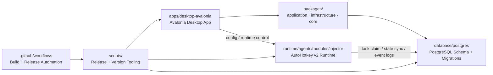

# PacToolkits

<div align="center">

[English](./README.md) | [简体中文](./README.zh-CN.md)

<br />

<table>
  <tr>
    <td align="center" width="260" valign="top">
      
      <br />
      <strong>PacToolkits Desktop</strong>
      <br />
      <sub>Avalonia Desktop Client</sub>
      <br />
      <sub>&nbsp;</sub>
      <br />
      
      <br />
      
    </td>
    <td align="center" width="260" valign="top">
      
      <br />
      <strong>PacToolkits Agents</strong>
      <br />
      <sub>AutoHotkey Automation Runtime</sub>
      <br />
      <sub>&nbsp;</sub>
      <br />
      
      <br />
      
    </td>
  </tr>
</table>

<br />

<sub><strong>Desktop</strong> for business operations · <strong>Agents</strong> for automation execution · <strong>DB</strong> for task orchestration and persistence</sub>

<br />
<br />

**Drug Trace-Code Operations Suite for Desktop, Automation, and Database Workflows**

PacToolkits Desktop, AutoHotkey automation, and PostgreSQL orchestration for drug trace-code operations.

</div>

---

## Project Overview

**PacToolkits** is a monorepo for drug trace-code operations, combining:

- PacToolkits Desktop for business workflows and diagnostics
- an AutoHotkey runtime for semi-automatic and warehouse injection flows
- a PostgreSQL schema and migration system for ingestion, mapping, tasking, and execution state

PacToolkits is designed for environments where **drug indexing, trace-code intake, inventory workflows, and automation-assisted injection** must stay aligned across Desktop, Agents runtime, and database state.

This repository is a coordinated system with:

- business-facing interaction in `apps/desktop-avalonia` (Avalonia)
- shared use cases and abstractions in `packages/application`
- PostgreSQL implementations in `packages/infrastructure`
- execution and automation in `runtime/agents/modules/injector`
- persistence, task orchestration, and schema evolution in `database/postgres`

---

## Highlights

- Unified desktop + automation + database architecture in one repository
- Avalonia-based business client with update and diagnostics capabilities
- Lucide-based icon system with lightweight custom status and busy indicators
- AutoHotkey v2 Agents modules (e.g. Injector) for parse, inject, and verify workflows
- Full ClassNN-based Agents/Injector configuration generated by PacToolkits Desktop
- PostgreSQL migration-based schema lifecycle with compatibility gates
- Versioned release pipeline for Desktop, Agents, and DB schema compatibility
- Operational visibility for inventory, mapping, MSFX linkage, and execution queues
- MSFX bill-watch recovery and manual task discard workflows for exception handling

---

## Architecture



---

## Repository Map

```text
pactoolkits/
  apps/desktop-avalonia/src/  Current production Desktop (Avalonia)
  packages/
    core/                     Pure domain helpers (no IO)
    application/              Use cases, DTOs, service abstractions
    infrastructure/           PostgreSQL repos and DB services
    agents-contracts/          Shared Desktop ↔ Agents protocol
  runtime/agents/modules/injector/          AutoHotkey v2 automation runtime
  database/postgres/          PostgreSQL bootstrap, migration, verify, deploy scripts
  docs/                       Architecture and operations documentation
  scripts/                    Versioning, packaging, release helpers
  .github/workflows/          CI/CD and release workflows
  PacToolkits.sln             .NET solution entry point
  release-manifest.json       Unified version source of truth
```

## Documentation

- [Monorepo layout](./docs/architecture/monorepo-layout.md)
- [Layering and dependency rules](./docs/architecture/layering.md)
- [Avalonia extraction plan](./docs/migration/avalonia-extraction-plan.md)
- [Release flow](./docs/operations/release-flow.md)
- [Beta release policy](./docs/operations/beta-release-policy.md)
- [Database compatibility policy](./docs/operations/database-compatibility-policy.md)

---

## Module Guide

## 1. `apps/desktop-avalonia`

**Role**

The desktop application is the operational center of the suite. It provides business workflows for inventory, drug indexing, scan entry, MSFX linkage, runtime control, update handling, and diagnostics. Page ViewModels call into `packages/application` services; database access lives in `packages/infrastructure`.

**Primary responsibilities**

- business dashboards and overview pages
- drug index maintenance
- trace-code entry and scan workflows
- inventory overview and reassignment workflows
- MSFX pull/map/task audit views
- MSFX bill-watch recovery and manual task discard actions
- MSFX task remap, merge, split, and manual-review flows
- AHK runtime configuration and control
- settings, logging, and update management

**Key areas**

- `Views/` and `ViewModels/`
- `Services/Application/` and `Services/Infrastructure/` (desktop-specific adapters)
- `Styles/`, `Controls/`, `Behaviors/`, `Converters/`
- `Docs/`

**Representative pages**

- `DashboardViewModel.cs`
- `DrugIndexViewModel.cs`
- `InventoryOverviewViewModel.cs`
- `ScanCodeViewModel.cs`
- `MsfxLinkViewModel.cs`
- `SettingsViewModel.cs`

**Technology**

- Avalonia 11
- CommunityToolkit.Mvvm
- Lucide.Avalonia
- SukiUI
- Velopack
- Project references: `PacToolkits.Application`, `PacToolkits.Infrastructure`, `PacToolkits.Agents.Contracts`

---

## 2. `runtime/agents/modules/injector`

**Role**

Agents (Host + modules) is the execution layer. It drives target desktop windows, parses grid content, injects trace codes, verifies outcomes, and synchronizes execution state back to PostgreSQL.

**Primary responsibilities**

- parse clipboard/grid content from target windows
- drive UI injection into target desktop applications
- verify injection results
- claim and execute warehouse inject tasks
- synchronize execution state and events back to PostgreSQL
- read config generated by PacToolkits Desktop

**Key modules**

- `main.ahk`
- `src/main_semi_auto.ahk`
- `src/msfx_task.ahk`
- `src/parse_clipboard.ahk`
- `src/ui_txn.ahk`
- `src/db_txn.ahk`
- `src/pg_exec.ahk`
- `src/utils.ahk`

**Execution model**

- `ipt/opt` flows remain atomic in AHK runtime logic
- warehouse mode consumes DB-backed inject tasks
- parse, inject, verify, and finalize are modularized
- warehouse duplicate protection is DB-backed and execution-aware
- runtime window, parse grid, verify grid, and input targets are configured through explicit full `ClassNN` fields rather than inferred suffixes
- inpatient standard flows no longer stop on warehouse-style soft checks unless warehouse mode is actually enabled
- Agents runtime metadata is initialized once and reused for version tags and client identity logging
- focus/copy handling for full `ClassNN` targets avoids unnecessary window activation and keeps grid targeting stable
- warehouse task execution now captures a click anchor and row fingerprint so duplicate-success protection can distinguish same bill rows more precisely

**Key Agents / Injector config fields**

PacToolkits Desktop now writes the Agents/Injector runtime targets explicitly. The current key fields are:

- `OptWindowClass`: top-level class for the outpatient window
- `IptWindowClass`: top-level class for the inpatient window
- `OptParseGridClassNN`: full `ClassNN` for the outpatient parse grid
- `OptVerifyGridClassNN`: full `ClassNN` for the outpatient verify grid
- `IptParseGridClassNN`: full `ClassNN` for the inpatient parse grid
- `IptVerifyGridClassNN`: full `ClassNN` for the inpatient verify grid
- `OptInputClassNN`: full `ClassNN` for the outpatient input target
- `IptInputClassNN`: full `ClassNN` for the inpatient / warehouse input target

Grid-style `ClassNN` values such as `TcxGridSite1` and `TcxGridSite2` are resolved by class name plus ordinal index, so the runtime can focus and copy from the intended grid instead of treating the suffix as part of a literal control name.

Related warehouse execution fields:

- `WarehouseEnabled`
- `WarehouseAnchorTexts`
- `CodePickPolicy`
- `WarehouseTaskIdentifier`

---

## 3. `database/postgres`

**Role**

The database module defines the persistence and orchestration model behind the suite. It holds schema bootstrap, migrations, verification scripts, and deployment tooling.

**Primary responsibilities**

- schema bootstrap
- incremental migrations
- verification and schema gating
- deployment planning and execution
- support for staging, mapping, task queueing, execution state, and audit records

**Structure**

```text
database/postgres/
  bootstrap/
  migrations/
  verify/
  scripts/
```

**Operational themes**

- inbound bill and detail ingestion
- trace-code staging
- drug/spec mapping
- inject task creation and queue ordering
- warehouse duplicate protection
- task reopen / retry / finalize flows
- task remap, merge, and split orchestration
- warehouse row-fingerprint dedupe for successful tasks

---

## 4. `scripts`

**Role**

This folder standardizes versioning, packaging, publishing, and operational deployment tasks so Desktop, Agents, and database changes stay aligned.

**Version and release scripts**

- `bump-version.sh`
  - bumps product / desktop / Agents / DB schema versions in the manifest and generated files
- `check-version.sh`
  - validates version consistency across the repository
- `export-version.sh`
  - exports manifest values into generated project files
- `release-desktop.sh`
  - packages and publishes desktop (Velopack) artifacts
- `release-agents.sh`
  - packages and publishes agents artifacts

**Repository maintenance**

- `audit-legacy-identity.sh`
  - fails CI/tooling if pre-monorepo paths (`pactoolkits-ui`, `pactoolkits-db`, …) reappear outside allowed compatibility shims
- `audit-unused-desktop-avalonia-resources.sh`
  - scans the desktop project for unreferenced styles, resources, and related leftovers

**Windows deployment / sync automation**

- `create_sync_task.ps1`
  - creates a silent scheduled task for feed synchronization
  - intended for dual-network Windows deployment environments
  - prompts for Windows credentials and registers the task with password logon for more reliable background execution
- `sync_pactoolkits_uu.ps1`
  - synchronizes update feed payloads to a local folder
  - performs change detection before download
  - prefers BITS and falls back to `Invoke-WebRequest` when BITS fails
  - only releases the global mutex when the lock is actually acquired

**Operational notes**

- Desktop writes the Agents runtime config and normalizes required fields on save
- Agents runtime consumes explicit window / parse / verify / input targets from config
- Windows sync tasks are designed for silent execution in operational environments

---

## 5. `.github/workflows`

**Role**

CI/CD workflows provide release automation for packaging, release-note generation, and publish coordination.

**Current workflows**

- `release.yml` — orchestrates tag / manual release
- `build-agents.yml` — build Agents host + Injector module
- `build-desktop-avalonia.yml` — publish Avalonia desktop (no bundled agents)
- `package-desktop.yml` — pack Desktop with the `agents` host (+ modules), Velopack
- `generate-release-notes.yml` — release notes (tag only)
- `publish-release.yml` — GitHub Release + update feed (tag only)

## Release and Update Flow

The current release and update chain supports only `stable` and `beta`. Versioning is driven by **manifest schema v2** in [release-manifest.json](./release-manifest.json).

> Beta is a test channel, not a production database upgrade path. A Beta application
> cannot migrate a shared production database by default. Beta database work requires
> an explicitly authorized isolated database.

1. Release manifest

- Everything is driven from [release-manifest.json](./release-manifest.json) (`schemaVersion: 2`)
- `product.version` is used as the Velopack `packVersion`
- `release.channel` is used as the release channel
- `components.agents` is the host package always shipped with Desktop; `components.agents.modules.<Id>.version` versions each module

1. Desktop packaging

- [build-desktop-avalonia.yml](./.github/workflows/build-desktop-avalonia.yml) publishes the desktop app
- [package-desktop.yml](./.github/workflows/package-desktop.yml) downloads each bundled Agents artifact and runs Velopack
- `packId` is fixed to `PacToolkits`
- `packVersion` uses `product.version`
- `channel` uses `release.channel`
- Main executable: `PacToolkits.Desktop.exe`

1. Asset publishing

- [publish-release.yml](./.github/workflows/publish-release.yml) uploads the release assets
- Feed payloads are synced into channel-specific subdirectories:
  - `.../stable/`
  - `.../beta/`
- Different channels are not mixed in one shared feed directory

1. Client update checks

- `AppUpdateService` resolves the feed to:
  - `FeedUrl/stable`
  - `FeedUrl/beta`
- The current version used for update decisions comes only from the Velopack installed version
- `ReleaseManifest.json` is no longer used to determine the current update version

1. Channel switching policy

- If the installed program channel matches the selected channel:
  - normal update checks run for that channel
- If they do not match:
  - the app does not perform automatic cross-channel switching
  - it explicitly tells the user to install the latest installer for the target channel
- This keeps database and config rollback risks out of the normal update flow

1. Database safety policy

- Application packages may be rolled back, but database schemas evolve forward by default
- A database above the target Stable `maxDbSchema` blocks switching back to Stable
- Restoring a database backup is a disaster-recovery operation, not a routine version rollback
- `isolated-beta` is limited to development and testing; it is not a production upgrade channel
- See [Beta release policy](./docs/operations/beta-release-policy.md) and
  [database compatibility policy](./docs/operations/database-compatibility-policy.md)

---

## Domain Coverage

PacToolkits currently spans these major business areas:

- drug trace-code intake
- trace-code entry and verification
- inventory overview and low-stock workflows
- drug information maintenance
- client alias management
- MSFX linkage, bill-watch recovery, and audit
- warehouse task injection, reopen, and discard handling
- runtime and Agents configuration management

---

## Versioning and Compatibility

Single source of truth:

- `release-manifest.json` (schema v2)

Current manifest:

- `product.version`: `1.0.2-beta.5`
- `components.desktop.<impl>.version`: `1.0.2-beta.5`
- `components.agents.version`: `0.1.0`
- `components.agents.modules.Injector.version`: `0.6.1`
- `components.database.postgres.version`: `1.2.23`
- `components.desktop.<impl>.minDbSchema`: `1.2.23`
- `components.desktop.<impl>.maxDbSchema`: `1.2.23`
- `components.agents.minDbSchema`: `1.2.23`
- `components.agents.maxDbSchema`: `1.2.23`

Common commands:

```bash
./scripts/bump-version.sh --desktop 0.12.1
./scripts/check-version.sh
./scripts/export-version.sh
```

## Getting Started

## Prerequisites

- .NET SDK 10.x
- PostgreSQL client tools such as `psql`
- shell environment with `bash`, `jq`, `zip`
- `vpk` for Velopack packaging
- `rsync` if publishing to a remote target

## Build solution

```bash
dotnet build PacToolkits.sln
```

## Build Desktop only

```bash
cd apps/desktop-avalonia/src
dotnet build -c Release
```

## Package Agents

```bash
cd pactoolkits
./scripts/release-agents.sh --skip-upload --dry-run
```

## Database Deployment

```bash
cd database/postgres
cp scripts/config.example.json scripts/config.json
# edit scripts/config.json
./scripts/deploy.sh doctor
./scripts/deploy.sh plan
```

---

## Release Workflow

## Desktop Release

```bash
./scripts/release-desktop.sh \
  --runtime win-arm64 \
  --vpk-directive win \
  --upload-target user@host:/var/www/updates/pactoolkits
```

`release-desktop.sh` appends the selected channel under that root path and only supports `stable` / `beta`.

## Agents Release

```bash
./scripts/release-agents.sh \
  --upload-target user@host:/var/www/updates/pactoolkits-agents/
```

---

## Design Principles

- One repository, one version source of truth
- Desktop, Agents, and DB evolve together
- Business-facing flows stay observable
- Automation remains configurable, not page-hardcoded
- Database owns task state and execution truth
- Runtime, Desktop, and persistence boundaries stay explicit

---

## JetBrains Support

This project is developed with support from the **JetBrains Open Source Support Program**.

JetBrains tooling helps maintain productivity across:

- Avalonia and .NET desktop development
- PostgreSQL and SQL authoring
- repository-wide navigation and refactoring
- multi-module monorepo workflows

Thanks to JetBrains for supporting the project:

- [JetBrains Open Source Support](https://www.jetbrains.com/opensource/)

---

## License

Released under the [GNU General Public License version 3 or later](./LICENSE) (`GPL-3.0-or-later`).
This project is free software; see the license file for copying conditions.
