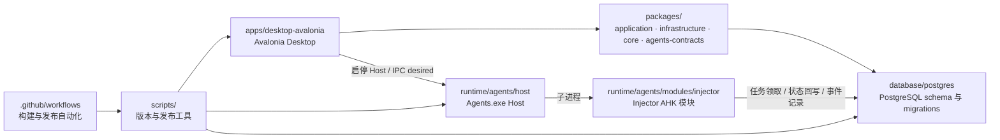

# PacToolkits

<div align="center">

[English](./README.md) | [简体中文](./README.zh-CN.md)

<br />

<table>
  <tr>
    <td align="center" width="260" valign="top">
      
      <br />
      <strong>PacToolkits Desktop</strong>
      <br />
      <sub>Avalonia 桌面客户端</sub>
      <br />
      <sub>&nbsp;</sub>
      <br />
      
      <br />
      
    </td>
    <td align="center" width="260" valign="top">
      
      <br />
      <strong>PacToolkits Agents</strong>
      <br />
      <sub>Host 与模块运行时</sub>
      <br />
      <sub>&nbsp;</sub>
      <br />
      
      <br />
      
    </td>
  </tr>
</table>

<br />

<sub><strong>Desktop</strong> 负责业务交互 · <strong>Agents</strong> 负责自动化执行 · <strong>DB</strong> 负责任务编排与持久化</sub>

<br />
<br />

**面向药品追溯码业务的桌面端、自动化与数据库一体化工具套件**

PacToolkits Desktop、Agents（Host 与模块）与 PostgreSQL 任务编排。

</div>

---

## 项目概览

**PacToolkits** 是一个围绕药品追溯码业务构建的单仓库项目，统一管理三类核心能力：

- PacToolkits Desktop 业务客户端
- Agents 运行时：.NET **Host**（`Agents.exe`）与独立自动化 **Modules**
- 负责数据持久化、业务映射、任务创建和执行状态管理的 PostgreSQL 数据库体系

仓库主要目录：

- [`apps/desktop-avalonia`](./apps/desktop-avalonia/)：业务交互、配置、更新与诊断
- [`apps/api-asp`](./apps/api-asp/)：HTTP 宿主
- `packages/application`：用例层服务与抽象
- `packages/infrastructure`：PostgreSQL 仓储与 DB 实现
- [`runtime/agents`](./runtime/agents/)：Host、自动化模块与模块模板
- [`database/postgres`](./database/postgres/)：入库、映射、任务与迁移

---

## 核心特性

- Desktop、Agents、DB 一体化单仓库设计
- 基于 Avalonia 的桌面业务客户端
- Agents 运行时：常驻 .NET Host（模块监管与 Snapshot）；Desktop 侧管 Host 生命周期与 desired
- 基于 PostgreSQL Migration 的数据库演进与兼容门禁
- Desktop、Agents 和数据库版本由 Manifest 统一管理
- 支持库存、追溯码录入、联调映射、任务队列与审计

---

## 系统架构



---

## 仓库结构

```text
pactoolkits/
  apps/desktop-avalonia/      Desktop 客户端（Avalonia）
  apps/api-asp/               HTTP 宿主（PacToolkits.Api）
  packages/
    core/                     纯业务核心（无 IO）
    application/              用例层：DTO、服务接口与应用服务
    infrastructure/           外部实现：PostgreSQL 仓储
    agents-contracts/         Desktop 与 Agents 共享协议
  runtime/agents/             Agents 运行时（Host 与模块）
  database/postgres/          PostgreSQL 初始化、迁移、验证与部署
  docs/                       跨模块架构与运维文档
  scripts/                    版本、打包、发布辅助脚本
  .github/workflows/          持续集成与发布流程
  PacToolkits.sln             .NET 解决方案入口
  release-manifest.json       版本与兼容性清单
```

---

## 文档

### 跨模块

- [Monorepo 布局](./docs/architecture/monorepo-layout.md)
- [分层与依赖规则](./docs/architecture/layering.md)
- [Agents 运行时架构](./docs/architecture/agents.md)
- [API 宿主与迁移](./docs/architecture/api.md)
- [Desktop 状态模型](./docs/architecture/desktop-state.md)
- [发布流程](./docs/operations/release-flow.md)
- [Beta 发布规则](./docs/operations/beta-release-policy.md)
- [数据库兼容与回退规则](./docs/operations/database-compatibility-policy.md)

### 子项目

- [Desktop](./apps/desktop-avalonia/README.md) · [概览](./apps/desktop-avalonia/docs/overview.md)
- [API](./apps/api-asp/README.md)
- [Agents](./runtime/agents/README.md) · [Injector](./runtime/agents/docs/injector.md)
- [PostgreSQL](./database/postgres/README.md) · [概览](./database/postgres/docs/overview.md)
- [脚本工具](./scripts/docs/tooling.md)

---

## 业务覆盖范围

- 药品追溯码入库
- 追溯码录入与验证
- 库存总览与低库存处理
- 药品信息维护
- 客户端别名管理
- 码上放心联调、账单监视补偿与审计
- 仓库任务注入、重开、弃用与诊断
- 自动化运行时配置管理

---

## 版本与兼容性

版本与兼容区间以 [`release-manifest.json`](./release-manifest.json) 为准（schema v2）。

```bash
./scripts/check-version.sh
./scripts/export-version.sh
```

发布、打包与通道策略见 [发布流程](./docs/operations/release-flow.md)。

---

## 快速开始

**环境要求：** .NET SDK 10.x、`psql`、`bash`、`jq` 和 `zip`；Velopack 打包还需要 `vpk`。

```bash
dotnet build PacToolkits.sln
```

- Desktop：见 [apps/desktop-avalonia/README.md](./apps/desktop-avalonia/README.md)
- API：见 [apps/api-asp/README.md](./apps/api-asp/README.md)
- Agents：见 [runtime/agents/README.md](./runtime/agents/README.md)
- 数据库：见 [database/postgres/README.md](./database/postgres/README.md)

---

## 设计原则

- 版本以单一发布清单为准
- Desktop、Agents、DB 协同演进
- 业务流程可观察、可追溯
- 自动化能力通过独立配置管理，不与页面逻辑耦合
- 任务与执行状态以数据库为准
- Desktop、运行时、持久化边界清晰

---

## JetBrains 支持

本项目受到 **JetBrains Open Source Support Program** 的支持。

感谢 JetBrains 对本项目的支持：

- [JetBrains Open Source Support](https://www.jetbrains.com/opensource/)

---

## License

本项目采用 [GNU 通用公共许可证第 3 版或更高版本](./LICENSE)（`GPL-3.0-or-later`）授权。
详见 LICENSE 文件中的复制、修改与分发条件。
