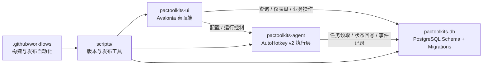

# PacToolkits

<div align="center">

[English](./README.md) | [简体中文](./README.zh-CN.md)

<br />

<table>
  <tr>
    <td align="center" width="260" valign="top">
      
      <br />
      <strong>PacToolkits UI</strong>
      <br />
      <sub>Avalonia 桌面客户端</sub>
      <br />
      <sub>&nbsp;</sub>
      <br />
      
      <br />
      
    </td>
    <td align="center" width="260" valign="top">
      
      <br />
      <strong>PacToolkits Agent</strong>
      <br />
      <sub>AutoHotkey 自动化运行时</sub>
      <br />
      <sub>&nbsp;</sub>
      <br />
      
      <br />
      
    </td>
  </tr>
</table>

<br />

<sub><strong>UI</strong> 负责业务交互 · <strong>Agent</strong> 负责自动化执行 · <strong>DB</strong> 负责任务编排与持久化</sub>

<br />
<br />

**面向药品追溯码业务的桌面端、自动化与数据库一体化工具套件**

用于药品追溯码业务的桌面 UI、AutoHotkey 自动化执行层与 PostgreSQL 任务编排数据库系统。

<br />

<table>
  <tr>
    <td align="center"><a href="./LICENSE"></a></td>
    <td align="center"><a href="https://www.jetbrains.com/opensource/"></a></td>
    <td align="center"></td>
    <td align="center"></td>
  </tr>
  <tr>
    <td align="center"><a href="./pactoolkits-ui"></a></td>
    <td align="center"><a href="./pactoolkits-agent"></a></td>
    <td align="center"><a href="./pactoolkits-db"></a></td>
    <td align="center"></td>
  </tr>
  <tr>
    <td align="center"><a href="./release-manifest.json"></a></td>
    <td align="center"><a href="./release-manifest.json"></a></td>
    <td align="center"><a href="./release-manifest.json"></a></td>
    <td align="center"><a href="./release-manifest.json"></a></td>
  </tr>
</table>

</div>

---

## 项目概览

**PacToolkits** 是一个围绕药品追溯码业务构建的单仓库项目，统一管理三类核心能力：

- 面向业务操作的桌面 UI
- 基于 AutoHotkey 的自动化 Agent
- 负责落库、映射、建任务、执行状态管理的 PostgreSQL 数据库体系

它面向的不是单一页面或单一工具，而是一个需要 **UI、自动化执行、数据库状态** 保持一致的完整系统。

当前仓库的三条主线分别是：

- `pactoolkits-ui`：业务交互、配置管理、更新能力、审计与诊断
- `pactoolkits-agent`：解析、注入、验证、任务执行
- `pactoolkits-db`：入库、映射、任务生成、执行状态与迁移治理

---

## 核心特性

- UI、Agent、DB 一体化单仓库设计
- 基于 Avalonia 的桌面业务客户端
- 基于 Lucide 的图标体系与轻量级状态 / 忙碌控件
- 基于 AutoHotkey v2 的自动化执行引擎
- Agent 运行目标已切换为完整 `ClassNN` 配置模型
- 基于 PostgreSQL Migration 的数据库演进体系
- UI / Agent / DB 版本统一由 Manifest 管控
- 支持库存、追溯码录入、联调映射、任务队列、重开与审计
- 支持 `MSFX` bill watch 补偿重查与任务手动弃用

---

## 系统架构



---

## 仓库结构

```text
pactoolkits/
  pactoolkits-ui/        Avalonia 桌面客户端
  pactoolkits-agent/     AutoHotkey v2 自动化运行时
  pactoolkits-db/        PostgreSQL bootstrap / migration / verify / deploy
  scripts/               版本、打包、发布辅助脚本
  .github/workflows/     CI / 发布流程
  release-manifest.json  全局版本与兼容性清单
```

---

## 模块说明

## 1. `pactoolkits-ui`

**定位**

桌面端是整个工具套件的业务操作中心，承载页面交互、配置管理、审计展示、更新控制与运行时联动。

**主要职责**

- 仪表盘与总览页
- 药品信息维护
- 追溯码录入与扫描流程
- 库存总览与库存调整
- 码上放心联调、拉取、映射、任务审计
- 码上放心 bill watch 补偿重查与任务弃用
- 码上放心任务回退映射、合并、拆分与人工复核流程
- AHK 自动化运行时配置与控制
- 设置、更新、日志与诊断能力

**主要目录**

- `Views/` 与 `ViewModels/`
- `Services/`
- `DataAccess/`
- `Styles/`、`Controls/`、`Behaviors/`、`Converters/`
- `Docs/`

**代表页面**

- `DashboardViewModel.cs`
- `DrugIndexViewModel.cs`
- `InventoryOverviewViewModel.cs`
- `ScanCodeViewModel.cs`
- `MsfxLinkViewModel.cs`
- `ToolsCenterViewModel.cs`
- `SettingsViewModel.cs`

**技术栈**

- Avalonia 11
- CommunityToolkit.Mvvm
- IconPacks.Avalonia.Lucide
- SukiUI
- Npgsql
- Velopack

---

## 2. `pactoolkits-agent`

**定位**

Agent 是自动化执行层，负责对目标窗口进行解析、注入、验证，以及与数据库任务队列进行同步。

**主要职责**

- 解析目标窗口 Grid / 剪贴板内容
- 向目标系统执行追溯码注入
- 注入后验证结果
- 领取并执行仓库注入任务
- 将执行结果与事件回写 PostgreSQL
- 读取 UI 生成的共享配置

**核心模块**

- `main.ahk`
- `src/main_semi_auto.ahk`
- `src/msfx_task.ahk`
- `src/parse_clipboard.ahk`
- `src/ui_txn.ahk`
- `src/db_txn.ahk`
- `src/pg_exec.ahk`
- `src/utils.ahk`

**执行模型**

- `ipt/opt` 走 AHK 原子执行链
- 仓库模式走数据库任务队列
- parse / inject / verify / finalize 模块化拆分
- 仓库重复注入防护与任务状态以数据库为准
- 窗口类、解析区、验证区、输入控件都以完整 `ClassNN` 配置为准，不再依赖代码内拼接推导
- 仅在真正启用仓库模式时才做仓库列特征软校验，住院普通链路不再被误拦截
- agent 运行时元信息会在启动时初始化一次，并复用于版本标识与客户端身份日志
- 完整 `ClassNN` 目标的聚焦/复制逻辑减少了不必要的窗口激活，网格控件命中更稳定
- 仓库任务执行会记录点击行锚点与行指纹，成功防重可以更精确地区分同单据内的不同行

**Agent 关键配置字段**

桌面端现在会将 agent 的运行目标显式写入配置。当前关键字段包括：

- `OptWindowClass`：门诊窗口顶层类
- `IptWindowClass`：住院窗口顶层类
- `OptParseGridClassNN`：门诊解析区完整 `ClassNN`
- `OptVerifyGridClassNN`：门诊验证区完整 `ClassNN`
- `IptParseGridClassNN`：住院解析区完整 `ClassNN`
- `IptVerifyGridClassNN`：住院验证区完整 `ClassNN`
- `OptInputClassNN`：门诊输入目标完整 `ClassNN`
- `IptInputClassNN`：住院 / 仓库输入目标完整 `ClassNN`

像 `TcxGridSite1`、`TcxGridSite2` 这样的 Grid 类 `ClassNN`，运行时会按“基类名 + 序号”解析，这样聚焦和复制时会命中正确的网格控件，而不是把尾部数字当作字面类名的一部分。

与仓库执行直接相关的字段还包括：

- `WarehouseEnabled`
- `WarehouseAnchorTexts`
- `CodePickPolicy`
- `WarehouseTaskIdentifier`

---

## 3. `pactoolkits-db`

**定位**

数据库模块负责整个系统的持久化建模与任务编排，是联调、映射、建任务、执行状态回写的事实来源。

**主要职责**

- bootstrap 初始化
- 增量 migration
- verify 校验
- 部署计划与执行
- staging / mapping / inject task / audit event 相关模型维护

**目录结构**

```text
pactoolkits-db/
  sql/bootstrap/
  sql/migrations/
  sql/verify/
  scripts/
```

**当前覆盖的关键主题**

- 上游单据与明细入库
- 追溯码 staging
- 药品 / 规格映射
- 注入任务生成与队列顺序
- 仓库模式重复注入防护
- 任务重开、重试与结算
- 任务回退映射、合并、拆分编排
- 仓库成功任务的行指纹防重

---

## 4. `scripts`

**定位**

统一管理版本号、构建发布、资源审计以及 Windows 侧部署同步任务，保证 UI、Agent、DB 三端协同演进。

**版本与发布脚本**

- `bump-version.sh`
  - 统一提升 suite / UI / agent / DB schema 版本
- `check-version.sh`
  - 校验仓库内版本一致性
- `export-version.sh`
  - 将 manifest 中的版本导出到生成文件
- `release-ui.sh`
  - 打包并发布 UI 产物
- `release-agent.sh`
  - 打包并发布 agent 产物

**仓库维护脚本**

- `audit-unused-ui-resources.sh`
  - 扫描 UI 项目中未引用的样式、资源与相关残留

**Windows 部署 / 同步脚本**

- `create_sync_task.ps1`
  - 创建静默计划任务，用于双网 Windows 环境下的更新同步
  - 会提示输入 Windows 凭据，并用 Password logon 注册任务，提升后台执行稳定性
- `sync_pactoolkits_uu.ps1`
  - 将远端更新源同步到本地目录
  - 先做变更探测，再执行下载
  - 优先走 BITS，失败时自动回退到 `Invoke-WebRequest`
  - 只有在成功拿到全局 mutex 后才会执行释放，避免误释放

**当前职责补充**

- UI 保存 Agent 配置时会自动补全和收敛必要字段
- Agent 运行时按配置中的完整窗口 / 解析区 / 验证区 / 输入控件目标执行
- Windows 同步任务适合库房双网环境下的静默后台执行

---

## 5. `.github/workflows`

**定位**

负责发布链的自动化构建、产物整理、发布说明生成与资源发布协调。

**当前工作流**

- `release.yml`
- `release-build-ui.yml`
- `release-build-agent.yml`
- `release-publish-assets.yml`
- `release-generate-notes.yml`

## 发布与更新链路

当前发布与更新主链只支持 `stable` / `beta` 两个通道。

1. 发布清单
- 统一读取 [release-manifest.json](./release-manifest.json)
- `suiteVersion` 作为 UI Velopack 包版本
- `build.channel` 作为当前发布通道

2. UI 打包
- [release-build-ui.yml](./.github/workflows/release-build-ui.yml) 负责构建 UI 安装包
- `packId` 固定为 `pactoolkits`
- `packVersion` 使用 `suiteVersion`
- `channel` 使用 `build.channel`

3. 产物推送
- [release-publish-assets.yml](./.github/workflows/release-publish-assets.yml) 负责发布产物
- feed 产物会同步到对应通道子目录：
  - `.../stable/`
  - `.../beta/`
- 不同通道不再混放到同一个 feed 目录

4. 客户端检查更新
- `AppUpdateService` 会把更新地址解析成：
  - `FeedUrl/stable`
  - `FeedUrl/beta`
- 更新判断所用的当前版本只认 Velopack 已安装版本
- `version.generated.json` 不再参与“当前更新版本”的判断

5. 通道切换策略
- 如果“当前安装程序通道”和“设置中的目标通道”一致：
  - 正常检查该通道更新
- 如果两者不一致：
  - 不做自动跨通道切换
  - 明确提示下载安装目标通道最新安装包完成切换
- 这样可以避免数据库或配置无法安全回退时的风险

---

## 业务覆盖范围

PacToolkits 当前覆盖的业务场景包括：

- 药品追溯码入库
- 追溯码录入与验证
- 库存总览与低库存处理
- 药品信息维护
- 客户端别名管理
- 码上放心联调、bill watch 补偿与审计
- 仓库任务注入、重开、弃用与诊断
- 自动化运行时配置管理

---

## 版本与兼容性

统一版本源：

- `release-manifest.json`

当前版本清单：

- `suiteVersion`: `0.17.1`
- `uiVersion`: `0.16.1`
- `agentVersion`: `0.6.1`
- `dbSchemaVersion`: `1.2.22`
- `uiMinDbSchema`: `1.2.22`
- `agentMinDbSchema`: `1.2.22`

常用命令：

```bash
./scripts/bump-version.sh --ui 0.12.1
./scripts/check-version.sh
./scripts/export-version.sh
```

---

## 快速开始

## 环境要求

- .NET SDK 10.x
- PostgreSQL 客户端工具，例如 `psql`
- `bash`、`jq`、`zip`
- Velopack 打包工具 `vpk`
- 若需远端上传，建议安装 `rsync`

## 构建 UI

```bash
cd pactoolkits-ui
dotnet build -c Release
```

## 打包 Agent

```bash
cd pactoolkits
./scripts/release-agent.sh --skip-upload --dry-run
```

## 部署数据库

```bash
cd pactoolkits-db
cp scripts/config.example.json scripts/config.json
# 编辑 scripts/config.json
./scripts/deploy.sh doctor
./scripts/deploy.sh plan
```

---

## 发布流程

## UI 发布

```bash
./scripts/release-ui.sh \
  --runtime win-arm64 \
  --vpk-directive win \
  --upload-target user@host:/var/www/updates/pactoolkits
```

`release-ui.sh` 现在会在这个根目录下自动追加所选通道子目录，并且只支持 `stable` / `beta`。

## Agent 发布

```bash
./scripts/release-agent.sh \
  --upload-target user@host:/var/www/updates/pactoolkits-agent/
```

---

## 设计原则

- 一个仓库，一个版本事实来源
- UI、Agent、DB 协同演进
- 业务流程可观察、可追溯
- 自动化能力可配置，不塞入页面逻辑
- 数据库拥有任务状态真相
- UI、运行时、持久化边界清晰

---

## JetBrains 支持

本项目受到 **JetBrains Open Source Support Program** 的支持。

JetBrains 提供的开发工具帮助我们更高效地处理：

- Avalonia / .NET 桌面开发
- PostgreSQL 与 SQL 编写
- 单仓库级别的导航、搜索与重构
- 多模块协同开发流程

感谢 JetBrains 对本项目的支持：

- [JetBrains Open Source Support](https://www.jetbrains.com/opensource/)

---

## License

Released under the [MIT License](./LICENSE).  
本项目基于 [MIT License](./LICENSE) 开源。
