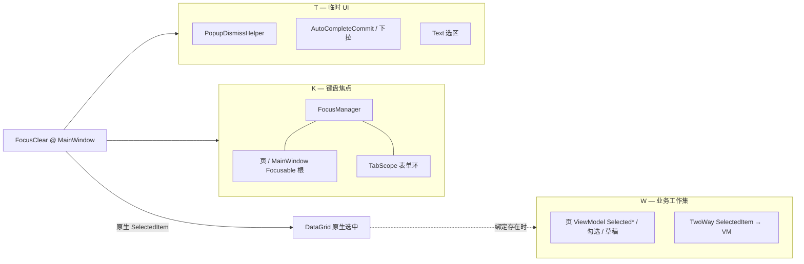

# Desktop 焦点与工作集模型

Avalonia Desktop（`apps/desktop-avalonia`）把「焦点」拆成三条互不混用的管道：键盘焦点（K）、临时 UI（T）、业务工作集（W）。壳层只统一 T、K 和 DataGrid **原生选中**；页面业务行选（绑定到 ViewModel 的当前行、勾选、编辑草稿）归各页所有。

相关实现：`Behaviors/FocusClear.cs`、`Behaviors/TabScope.cs`、`Common/PopupDismissHelper.cs`、`Common/InputFocusHelper.cs`、`Common/DataGridInteractionHelper.cs`、`Common/AutoCompleteCommit.cs`。

## 三条管道

| 管道 | 含义 | 所有者 |
| ---- | ---- | ------ |
| **K** | 谁接收键盘输入 | `FocusManager`；空白落点为 `FocusClear.Enable` 所在 host（通常 MainWindow）；表单环为 `TabScope` |
| **T** | 瞬时 chrome | 打开中的 Popup / Combo / AutoComplete 下拉、Text 字符选区 |
| **W** | 业务“当前行 / 勾选 / 正在编辑” | 页 ViewModel（如 DrugIndex `Selected` + 编辑器、MSFX 勾选快照） |

命名约束：不要说「清焦点」指代清空 `Selected`。业务清空用 `ClearWorkingSet` 或清空对应 `Selected*`/`IsSelected`。

### 原生表选中与 W 的关系

DataGrid 控件自身的 `SelectedItem` / 行高亮是 **原生选中**，不是 ViewModel 抽象。壳层默认在空白点击时清理它；若该绑定 TwoWay 到 VM，效果上等于清 W 行。需要「空白后仍保留当前行驱动编辑区」的页面，在页根声明 `FocusClear.SuppressGridClear`（当前：DrugIndex），由页自己决定何时 `ClearWorkingSet`。

多表同屏时，同一时刻应只有一张表保留原生选中：点击某一表时，`FocusClear` 清除其它表的原生选中，当前表保留。这与页级勾选工作集（`ISelectableRow.IsSelected`）正交，勾选由 `DataGridRowSelection` 等自行管理。

## 组件职责

| 组件 | 职责 | 不负责 |
| ---- | ---- | ------ |
| `FocusClear`（MainWindow `Enable`） | 空白抬 K、表外清原生选中、表内清 peer；与 `SkipPopupDismiss` 对齐后不抢候选面 | 业务 reload/W；表单 Tab；下拉 light-dismiss（交 `PopupDismissHelper`） |
| `SuppressGridClear` | 声明子树不参与壳层原生表清选 | 代替页内 W 策略 |
| `PopupDismissHelper` | TopLevel 内 light-dismiss Combo/日历/菜单/普通 Popup；**不强制关 ACB**（选区护栏见 `AutoCompleteSelectionGuard`，外侧靠原生 light-dismiss） | 业务选中、键盘环、ACB 强制 CloseDropDown |
| `DataGridInteractionHelper` | 原生 selection / currency / 翻页高亮 API | 页面业务规则 |
| `TabScope` + `InputFocusHelper` | 表单 Tab/Enter 输入环（K） | 空白点击、W |
| 页 ViewModel | W 的生命周期（reload、保存 reselect、详情关闭清行等） | 全局 pointer 策略 |

Pointer 统一走 **Bubble**（`FocusClear`、`PopupDismissHelper`），避免 Tunnel 在 AutoComplete 候选尚未选中前关掉下拉。

## 指针策略（`FocusClear`）

在挂了 `Enable` 的 host 上，对 Bubble 的 `PointerPressed`：

1. 若命中另一 TopLevel（native popup 等），不处理  
2. 若命中打开中的下拉/Popup 候选面（`SkipPopupDismiss`），不处理（下拉关闭由 `PopupDismissHelper` 自管）  
3. 若当前键盘焦点在 **可编辑输入** 且指针仍在其内，保留焦点  
4. 否则：离开 AutoComplete 时先 `CommitPendingInput` 再关下拉；离开 TextBox 时清字符选区  
5. **命中某 DataGrid 子树**：清其它表原生选中，保留当前表 → **return**（不 `host.Focus`，保证首次点行有效）  
6. **未命中 DataGrid**：清所有无 suppress 祖先的 DataGrid 原生选中  
7. 可编辑输入 / Button / Menu / Tab：不抢 host；否则同步 `host.Focus()` 抬走 K  

可编辑与「可 Focus 的大块容器」必须区分：MainWindow 与页 root 若被当成“仍在焦点控件内”，会导致空白点击永远不清选、不抬 K。

## 表单键盘环（`TabScope`）

| 属性 | 含义 |
| ---- | ---- |
| `Enable` | 在控件上隧道处理 Tab / Enter |
| `RootName` | 环的枚举根（空=自身）；如 DrugIndex `EditorCard` |
| `IncludeComboBox` | 是否把 ComboBox 纳入环（Settings 为 true） |

环枚举与步进实现放在 `InputFocusHelper`；页面只挂属性，不在 code-behind 再写一份 KeyDown 环。

## 页面约定

| 页面 | K | W | 空白与原生表选 |
| ---- | - | - | -------------- |
| MainWindow | shell host | — | 全局 `FocusClear` 规则 |
| DrugIndex | 页 + `TabScope`→EditorCard | `Selected` + 编辑器；reload 用 `WorkingSetReload`；保存后 `ReselectRow` | 页根 `SuppressGridClear`，空白不清表选 |
| InventoryOverview | 页 root | 行 / 重分配 | 默认清原生表选 |
| MsfxLink | 页 root | 各 `Selected*`、任务勾选 | 默认清原生表选；运行中心详情关闭清对应行选并还 K |
| ScanCode | 页 root | 药 / 码编辑 | 默认清；多表 peer 由壳层 |
| Settings | 页 + `TabScope`（含 Combo） | 表单字段态，无行 W | 无业务 DataGrid 工作集 |
| Dashboard | 壳 / 页 | 面板局部 | 默认清；翻页可走 pager `ClearTarget` |

DrugIndex 工作集在 reload 上的语义：

| `WorkingSetReload` | 行为 |
| ------------------ | ---- |
| `Keep` | 尽量保持或按挂起键重新选中 |
| `Clear` | 在无未保存草稿时清空 `Selected` 与编辑器基线 |

`forceFull` 路径在 `ApplyFullReload` 内自行清空工作集，不叠加 `Clear` 参数。

## 反模式

- 用「焦点」一词同时指 K 与 W  
- 各页 `SelectionChanged` 手写「点 B 清 A」复制壳层 peer 逻辑  
- 为“兼容旧入口”保留无调用的清焦点 shim / 双路径  
- 在页面 code-behind 复制 `TabScope` 已覆盖的 Tab 环  
- 把 MainWindow / 页 root 当成可编辑输入保留区，导致空白点击失效  
- 壳层经 Tunnel 处理 pointer，抢在 AutoComplete 选中之前关下拉  
- 无 `SuppressGridClear` 又期望空白后编辑区仍绑定当前行（应改页声明 suppress，或改 W 设计）  
