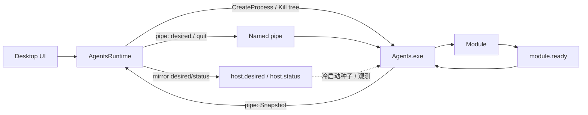

# Agents 运行时架构

Agents 是独立部署的自动化运行时，由常驻 Host 与一个或多个模块进程组成。边界只有三条：

1. **Contracts**（`packages/agents-contracts`）— IPC 与 Snapshot 模型；零依赖
2. **Host**（`runtime/agents/host`，`Agents.exe`）— 发现、desired reconcile、模块启停/崩溃/ready/模块热更、发布 StatusSnapshot
3. **Desktop 侧**（`AgentsRuntime` 等）— UI、OS 级 Host 进程树、会话 desired、投影 Snapshot

Desktop **不**枚举/Kill 模块 PID（启停 Host 闸门的入口孤儿扫杀除外）、**不**轮询扫盘 catalog、**不**写 `module.ready`。Admit 挂/卸模块只改 **desired**。

当前模块包括：

- **Injector**：生产业务模块（解析、注入、回写）
- **Scanner**：模块开发与交付链路的验证模块

实现：`runtime/agents/`、`packages/agents-contracts/`；Desktop 入口 `IAgentsRuntime` / `AgentsManager`（内部用 `IAgentsClient` 链路，契约不继承）。

## 术语

| 术语         | 定义                                                                                                         |
| ------------ | ------------------------------------------------------------------------------------------------------------ |
| **Agents**   | Host、模块与发布清单，默认安装在 `Agents/`                                                                   |
| **Host**     | `Agents.exe`：desired reconcile、模块进程监管、Snapshot / moduleFailed                                       |
| **Module**   | `Modules/<Id>/` 独立进程；`module.json` 描述入口与桌面元数据；协议区间由清单 export 写入（运行时只读此文件） |
| **Desktop**  | 配置与 UI；CreateProcess/超时强杀 **Host 树**；会话 **desired**；展示 Snapshot                               |
| **desired**  | 期望挂载的模块 ID 集合（持续意图，非一次性 start 命令）                                                      |
| **Snapshot** | Host 发布的 status schema v2（主路径走管道；磁盘为镜像）                                                     |

## 部署布局

```text
Agents/
  Agents.exe
  ReleaseManifest.json
  host.desired.json      # 镜像：冷启动种子 / 诊断（不参与控制决策）
  host.status.json       # 镜像：观测（管道优先）
  Modules/
    <Id>/
      module.json
      settings.json
      settings.schema.json
      module.ready       # 模块自检完成；仅 Host 读取
      <Entry>.exe
```

**实时控制走命名管道**（`desired` / `quit` / status 推送 / `moduleFailed`）；管道名由安装目录唯一确定。  
`host.desired.json` / `host.status.json` / `module.ready` 是协议文件镜像，不是 Desktop 与 Host 的双写控制协议。协议不含 `host.control` / `module.control`，也不使用 status schema v1。

Host 控制环负责进程监管，catalog 和状态镜像按各自节奏更新；运行态变化通过管道主动通知。Desktop 仅在配置内容变化时同步，并合并重复的文件事件。

## 控制与观测



| 能力        | Desktop                                                                                                         | Host                                               |
| ----------- | --------------------------------------------------------------------------------------------------------------- | -------------------------------------------------- |
| 控制        | 管道 `desired` / `quit`；文件只镜像                                                                             | 管道服务；未收过 IPC 时可用 desired 文件种子       |
| Snapshot    | 管道缓存优先；文件观测镜像；本地 CreateProcess 失败优先 Failed                                                  | 合成 state / LastError / catalog，schema **仅 v2** |
| catalog     | 只吃 Snapshot；不轮询扫盘                                                                                       | 秒级扫 `Modules/*/module.json` 并入 Snapshot       |
| 启模块      | **先门禁**再 `desired` 加入 id（仅可挂集合）；等 Snapshot Running/Failed；已连接则不重连                        | reconcile 启动；超时或失败写入 Snapshot            |
| 停模块      | desired 去掉 id；等 Snapshot Stopped                                                                            | reconcile 停止                                     |
| 停 Host     | desired=[] 再 quit；超时 **Kill Host 进程树**                                                                   | quit 后 StopAll 子模块                             |
| 模块 PID    | **运行时监管无**；**Host 启停闸门**可按入口路径清残留（防双实例）                                               | 子进程树 Kill / 热更重启                           |
| PacAPI 协议 | **Application** `IAgentsAdmitService` 用探测到的 `contractVersion` 与模块区间 Classify 后，仅可挂 id 进 desired | 只跟 desired                                       |

**协议门禁**：`Enabled` 是用户偏好；`desired` 只含当次允许运行的子集。为何不能挂由 Desktop 投影/`LastError` 说明，Host 不接收协议事实、不二次决策。

**模块协议小门**：Application `SemVerRange.Classify`（Admit 用探测到的 `contractVersion` 与模块 `minApiContract`/`maxApiContract`）。批量 Admit 时协议版本只取一次探测结果；与 Agents 包的 `minDesktop`/`maxDesktop` 无关（后者每次起 Host 从 Agents 安装树现读）。`IAgentsBundleService` 只做 Agents×Desktop 产品 SemVer

**Agents 与 Desktop 配套**：Host 路径已有效后读 **Agents 安装树**旁 `ReleaseManifest.json`（`components.agents.minDesktop` / `maxDesktop`），与当前 Desktop 产品 SemVer 比较（`IAgentsBundleService`）；再过 OS 门禁。清单/组件缺失、区间不全、Desktop 版本未知或不可解析一律拒绝，不放宽。Agents 可独立自更新，不以 Desktop 安装目录清单为准。

**UI 开关**：Host/模块「开」仅 **Running**（Starting/Failed 用 tip/灯色，与 Settings 一致）。

desired 在会话内是**持续挂载意图**（已过 Desktop 门）：进程非 0 退出或未 ready 失败记 sticky Failed，不再热循环；ready 后正常 exit 0 且仍在 desired 时可再起。

新增目录可被 Host 动态发现，**发现 ≠ 启动**。Desktop 起 Host 并连上管道后，按 Snapshot catalog 与门禁通过的启用集写 desired；运行中新模块须用户显式启。

## 日志

Host 与 AHK 模块与 Desktop 共用日志根（默认 LocalAppData，可由 `Logging.LogDirectory` 自定义），JSON Lines：

```text
{logsRoot}/
  desktop/YYYY-MM-DD[.N].log
  agents/host/YYYY-MM-DD[.N].log
  agents/modules/<Id>/YYYY-MM-DD[.N].log
```

路径见 `AgentsLogPaths`；.NET 见 `packages/logger`；AHK 见 `runtime/agents/lib/ahk/log.ahk`。单文件 `MaxFileSizeMb` 后递增 `N`；`RetentionDays` 清理。

字段：`ts`、`level`、`module`、`event`、`message`、`version`、`context?`、`exception?`。`level` 仅 `Debug` / `Info` / `Warn` / `Error` / `Fatal`。

日志策略：Desktop `Logging.*` 作用于 Desktop 与 Host（Host 读 `--config`）；模块用户 `settings.json` 门控走 AHK `Log_ApplySettings`

## 配置所有权

| 配置                  | 位置                                            | 说明                                                                          |
| --------------------- | ----------------------------------------------- | ----------------------------------------------------------------------------- |
| Host 路径与模块启用   | `PacToolkits.Desktop.config.json`               | Desktop 维护；`Agents.Modules[id].Enabled`                                    |
| 模块 PacAPI 凭据      | 环境 `PAC_API_BASE_URL` / `PAC_API_KEY`         | 缺省读 `--config` 的 `PacApi.BaseUrl` / `AgentsApiKey`；不读 Desktop `ApiKey` |
| 模块默认与表单 schema | `Agents/Modules/<Id>/settings.*`                | 随模块发布                                                                    |
| 模块用户配置          | `{ConfigDir}/agents/modules/<Id>/settings.json` | 首次从默认复制；升级不覆盖                                                    |

`Agents.Modules` catalog 与启用键由 Runtime 根据 Host StatusSnapshot merge。
Host 启动模块时 `--module-settings` 传用户配置路径。

## 模块描述与发现

`module.json` 至少含 `id`、`version`、`runtime`、`displayName`、`entry.win-x64`、`desktop.*`、`package.builder`。  
模块 ID 与目录名一致；首字符字母或数字，其余 ASCII 字母数字 `.` `_` `-`。

Host 扫目录；Desktop 设置页无 catalog 时为空（须路径正确并在**支持平台**成功起 Host 拿到 Snapshot）。闸门清孤儿时 catalog 可为空，退化为扫盘一次。

## 配置保存与生效

- schema/用户配置无效时记模块级错误，不生成残缺表单
- 布尔/枚举自动保存（模块内合并批次）；文本等随页保存
- 运行中模块业务配置变化则重启**该模块**（desired 热更）
- Host 路径/进程名变化才重启 Host
- 未运行模块只写盘不启动
- Desktop 模块命令串行；自动保存新批次取代未执行的旧批次

## 二进制更新

双次稳定观测（长度与 mtime）后再认变更。

| 目标       | 监视方  | 行为                                                     |
| ---------- | ------- | -------------------------------------------------------- |
| Host.exe   | Desktop | Host 活跃且文件稳定变化时重启 Host，再按启用集发 desired |
| 模块入口   | Host    | 运行中模块热更；Desktop 不处理模块 PID                   |
| 未运行模块 | —       | 文件变化不自动启动                                       |

不负责下载、选版、回滚。失败不接新基线，延迟重试。

## 进程参数

1. Desktop：`Agents.exe --config <Desktop 配置绝对路径>`
2. Host 转发非本机参数，并为每模块追加 `--module-settings <用户配置绝对路径>`
3. 模块 ready 后发 `module.ready`
4. Host 不解析 Desktop 配置内容；职责为 desired、监管、Snapshot

## 契约分层（packages/agents-contracts）

| 类型                                                              | 职责                                                                     |
| ----------------------------------------------------------------- | ------------------------------------------------------------------------ |
| `IAgentsRuntime`                                                  | Desktop Host OS 启停、会话 desired、状态查询；**不**继承 `IAgentsClient` |
| `IAgentsClient`                                                   | 管道 Connect / desired / quit / Snapshot / ModuleFailed                  |
| `AgentsStatus` / `AgentsDesired` / `AgentsIpc*` / `AgentsObserve` | Snapshot v2、desired、管道帧、状态合成纯函数                             |
| `AgentsPath` / `AgentsPaths`                                      | 路径解析、描述文件、Host 侧目录扫描                                      |
| `IModuleSettingsStore` 相关契约                                   | 由 Desktop 实现：默认复制 / 用户配置 / schema                            |

该包零依赖。Host 引用路径与协议类型；模块不引 C# 包，走命令行与文件。

Desktop（`Services/Integration/Agents/`）组合：`AgentsLink`、`AgentsHostLauncher`、`AgentsDesiredSession`、`AgentsSnapshotProjection` 等；组装细节不是第四套公共层

## 构建与发布

| 产物     | 方式                                                    |
| -------- | ------------------------------------------------------- |
| Host     | .NET framework-dependent single-file，产出 `Agents.exe` |
| AHK 模块 | Ahk2Exe，入口文件名 `entry.win-x64`                     |

CI 以 `runtime/agents/modules/*/module.json` 对齐 `release-manifest.json`。详见 [发布流程](../operations/release-flow.md)。

## 相关文档

- [Agents 运行说明](../../runtime/agents/README.md)
- [Injector 模块](../../runtime/agents/docs/injector.md)
- [分层与依赖规则](./layering.md)
- [Monorepo 布局](./monorepo-layout.md)
- [发布流程](../operations/release-flow.md)
