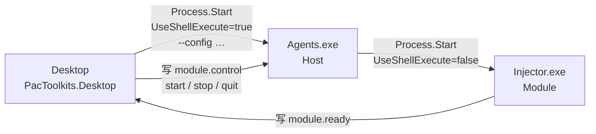

# Agents 运行时架构

Agents 不是「单独一个 AHK 程序」。它是 **安装容器 + .NET Host + 可插拔 Modules**；当前唯一业务模块是 Injector（AutoHotkey v2 编译为 `Injector.exe`）。

相关源码：`runtime/agents/host/`、`runtime/agents/modules/injector/`、`packages/agents-contracts/`、桌面 `AgentsRuntime` / `AgentsManager`。

## 角色与命名

| 名称         | 是什么                                                | 不是什么                               |
| ------------ | ----------------------------------------------------- | -------------------------------------- |
| **Agents**   | 安装目录容器（默认 `.\Agents\`）                      | 产品里的「AHK 进程名」                 |
| **Host**     | 入口进程 `Agents.exe`（.NET），按控制文件启停 Modules | 中文「宿主」产品名；不要叫「AHK Host」 |
| **Injector** | 一个 Module（AHK → `Injector.exe`）                   | 整个 Agents 栈                         |

发布布局：

```text
Agents/
  Agents.exe              ← Host（常驻入口）
  Modules/
    Injector/
      module.json
      Injector.exe        ← 模块进程
```

## 进程关系



要点：

1. Desktop 与 Host、Injector 都是**独立 OS 进程**（任务管理器「详细信息」各占一行属正常）。
2. Injector 由 Host 启动，在系统里是 Host 的子进程；Host **不会**在启动时自动带上模块。
3. Desktop 在 Host 起来后，若 `Injector.Enabled`，向 `Modules/Injector/module.control` 写入 `start`，并等待 `module.ready`（自检通过标记）。
4. `stop`：只停模块，Host 继续常驻。`quit`：停模块并退出 Host。
5. Desktop 传给 Host 的 `--config <path>` 由 Host **原样转发给** Injector；**Host 自身不读配置 JSON**。

控制 / 就绪文件约定见 `AgentsPaths`（`module.control`、`module.ready`、`module.json`）。

## Desktop 控制面

| 类型                               | 职责                                                                        |
| ---------------------------------- | --------------------------------------------------------------------------- |
| `IAgentsManager` / `AgentsManager` | 按 id 注册 runtime；`Reload` / `StopAll`                                    |
| `IAgentsRuntime` / `AgentsRuntime` | Host / Injector 状态、启停、版本与错误字段                                  |
| `AgentsPath`                       | 解析 `.\Agents\Agents.exe`；Legacy `Tools\pacinjector.exe` 仅迁移与停旧进程 |

启停主路径：`StartOrRestartAsync`（Host）→ 可选写入 `module.control` 的 `start` → 等待 `module.ready`；`StopAsync` 写入 `quit`；`StopInjectorAsync` 写入 `stop`。

配置根在 Desktop `AppConfigStore`：`Agents`（可执行路径等）+ 嵌套 `Injector`（窗口类、ClassNN、仓库开关、`AppWin` 等）。共享形状在 `packages/agents-contracts`；Application 层另有 DTO 镜像供桌面映射。

## 打包

| 产物                             | 方式                                                                                                           |
| -------------------------------- | -------------------------------------------------------------------------------------------------------------- |
| Host                             | framework-dependent + `PublishSingleFile` → `Agents.exe`（不嵌 .NET runtime）                                  |
| Injector                         | Ahk2Exe → `Injector.exe` + `module.json`                                                                       |
| 版本源                           | `release-manifest.json` → `export-version.sh` 写出各处 `ReleaseManifest.json`，并同步 `module.json` 的 version |
| Host 旁的 `ReleaseManifest.json` | 仅供源码树同步与 `check-version` 校验；**Host 进程不读取**；CI 产物也不强制附带                                |

路径与 CI 细节见 [发布流程](../operations/release-flow.md)。

## Injector 热键限制

热键受 `#HotIf Util_HotIf_TargetApp()` 约束：当前前台窗口进程须在 `AppWin`，且窗口类等于 `OptWindowClass` 或 `IptWindowClass`（仓库模式仅住院类）。配置里没有「任意窗口都触发」的开关；详见 [Injector](../../runtime/agents/docs/injector.md)。

## 相关文档

- [Agents README](../../runtime/agents/README.md)
- [Injector](../../runtime/agents/docs/injector.md)
- [分层](./layering.md)
- [Monorepo 布局](./monorepo-layout.md)
- [发布流程（路径解析）](../operations/release-flow.md)
