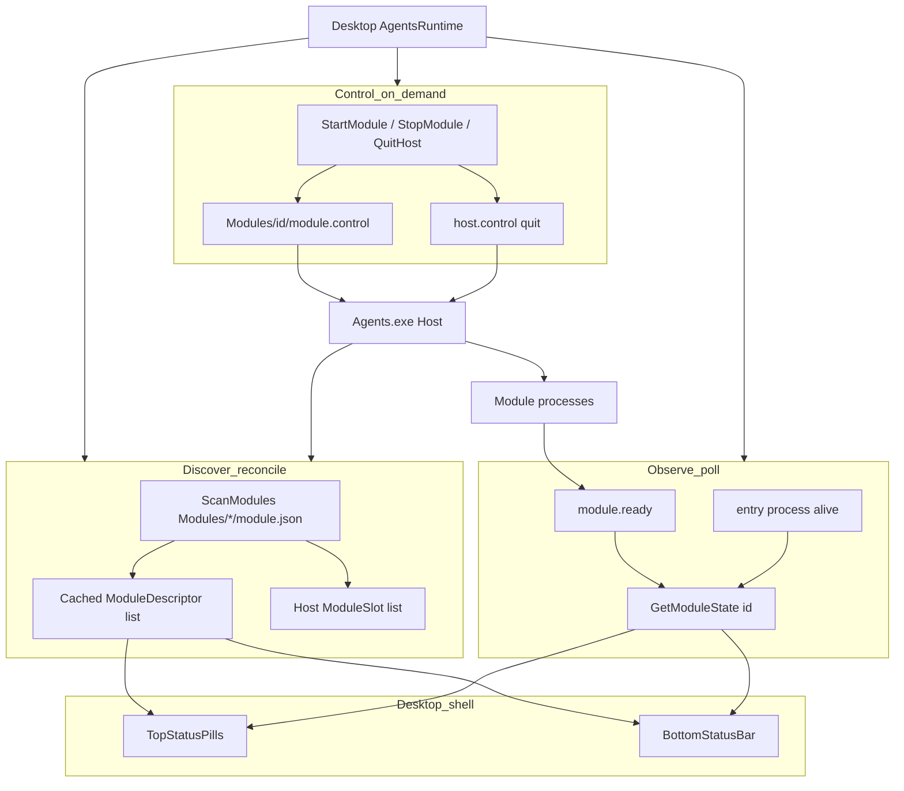

# Agents 运行时架构

Agents 不是「单独一个 AHK 程序」。它是 **安装容器 + .NET Host + 可热插拔 Modules**；Injector 是正式业务模块，Scanner 是用于验证模块契约的测试模块，两者都由 AutoHotkey v2 编译。

相关源码：`runtime/agents/host/`、`runtime/agents/modules/injector/`、`packages/agents-contracts/`、桌面 `AgentsRuntime` / `AgentsManager`。

## 角色与命名

| 名称         | 是什么                                               | 不是什么                               |
| ------------ | ---------------------------------------------------- | -------------------------------------- |
| **Agents**   | 安装目录容器（默认 `.\Agents\`）                     | 产品里的「AHK 进程名」                 |
| **Host**     | 入口进程 `Agents.exe`（.NET），监管 `Modules/*`      | 中文「宿主」产品名；不要叫「AHK Host」 |
| **Module**   | `Modules/<Id>/` 下一套可启停进程（manifest + entry） | Host 本身                              |
| **Injector** | 一个 Module（AHK → `Injector.exe`）                  | 整个 Agents 栈                         |

发布布局：

```text
Agents/
  Agents.exe
  host.control
  Modules/
    <Id>/
      module.json
      settings.json           ← 模板（随 Agents 包）
      settings.schema.json    ← Settings 自动表单
      module.control
      module.ready
      <Entry>.exe
```

## 配置三层

| 层               | 位置                                                         | 内容                                              |
| ---------------- | ------------------------------------------------------------ | ------------------------------------------------- |
| **产品模板**     | `Agents/Modules/<Id>/settings.json` + `settings.schema.json` | 默认业务字段 + 表单描述                           |
| **用户真相**     | `{ConfigDir}/agents/modules/<Id>/settings.json`              | 首次从模板 **Copy-once**；Settings 只改这份       |
| **Desktop 全局** | `PacToolkits.Desktop.config.json`                            | Postgres、Host 路径、`Agents.Modules[id].Enabled` |

```text
Agents（Desktop 大 JSON）
  ExecutablePath / ProcessName
  Modules: { "<扫描到的模块 Id>": { Enabled } }
```

- 用户文件已存在时，Agents 更新 **不会** 覆盖用户 settings。
- Settings Agents 页：Host 区 + 模块列表；按 `settings.schema.json` 自动生成表单（样式对齐 Field/H3），schema 或 settings 无效时显示明确错误态。
- Host 启动模块时追加 `--module-settings <用户路径>`；模块进程只读该文件。

## 热插拔四层模型



| 层       | 职责                                                            | 频率                                          |
| -------- | --------------------------------------------------------------- | --------------------------------------------- |
| **发现** | 扫 `Modules/*/module.json`，reconcile Desktop 缓存与 Host slots | Desktop ~1s；Host ~250ms；`Reload` 仍全量刷新 |
| **观测** | 进程 + `module.ready` → `GetModuleState`                        | ~1s poll                                      |
| **控制** | `StartModule` / `StopModule` / Host `quit`                      | 按需                                          |
| **壳层** | 顶栏 pills / 底栏 status                                        | 绑定缓存                                      |

要点：

- **发现 ≠ 自动挂载**：新目录出现后进入清单与 Settings；仍须 Enabled + Start（或 Host 启动时挂已启用模块）。
- **模块 Id 是可移植令牌**：首字符须为 ASCII 字母或数字，其余仅允许字母、数字、`.`、`_`、`-`；目录名、`module.json` 的 `id` 与控制命令须完全同大小写。
- **清单变化写回开关**：Desktop rediscover 后 `Load()` → `NormalizeModules`（稳定非空清单中新 id 默认 Enabled、孤儿丢弃；安装/热更新期间的空清单保留原开关）。
- **Host 可空转**：无模块时 Host 仍可存活，待目录落盘后再 reconcile。
- **Enabled 不参与观测**：关掉只禁止 Start；进程仍在则 UI 仍显示 Running。
- **模块不进 DI**：清单以磁盘 `module.json` 为准。
- **模块配置互不影响**：业务配置保存后只重挂发生变化且正在运行的模块；Host 路径或进程名变化才重启 Host。
- **二进制更新按运行单元处理**：运行中或启动中的 Host 二进制稳定变化后重启 Host；模块二进制稳定变化后只重挂对应模块。停止态变化只推进观测基线，不自行启动。
- **稳定变化不是中间写入**：文件长度与最后写入时间连续两次一致后才执行重启；失败不接受新基线，延迟后继续重试。

## 进程关系

1. Desktop 传 `--config` 给 Host；Host 再按模块追加 `--module-settings`。
2. Host **不读**配置 JSON；模块读 Postgres（`--config`）+ 业务（`--module-settings`）。
3. `stop` 只停模块；`host.control=quit` 退 Host。

## Desktop 控制面

| 类型                   | 职责                                      |
| ---------------------- | ----------------------------------------- |
| `IAgentsRuntime`       | Host / Modules 状态、启停、缓存 `Modules` |
| `IModuleSettingsStore` | Copy-once + 读写用户 settings / 读 schema |
| `AgentsPath`           | 解析 Host；`ScanModules`                  |

## 打包

| 产物     | 方式                                                                                 |
| -------- | ------------------------------------------------------------------------------------ |
| Host     | PublishSingleFile → `Agents.exe`                                                     |
| AHK 模块 | Ahk2Exe → `entry.win-x64` + `module.json` + `settings.json` + `settings.schema.json` |

详见 [发布流程](../operations/release-flow.md)。

## 相关文档

- [Agents README](../../runtime/agents/README.md)
- [Injector](../../runtime/agents/docs/injector.md)
- [分层](./layering.md)
