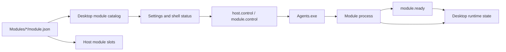

# Agents 运行时架构

Agents 是独立部署的自动化运行时，由常驻 Host 与一个或多个可执行模块组成。Desktop 负责配置、运行控制和状态展示；Host 负责模块进程监管；模块实现具体业务自动化。

当前模块包括：

- **Injector**：生产业务模块，负责目标系统解析、追溯码注入、结果验证和任务状态回写
- **Scanner**：模块开发与交付链路的验证模块

相关实现位于 `runtime/agents/`、`packages/agents-contracts/`，Desktop 侧入口为 `AgentsRuntime` 与 `AgentsManager`。

## 术语

| 术语        | 定义                                                                |
| ----------- | ------------------------------------------------------------------- |
| **Agents**  | Host、模块及发布清单组成的部署单元，默认安装在 `Agents/`            |
| **Host**    | `Agents.exe`，负责接收控制命令、维护模块目录和监管模块进程          |
| **Module**  | `Modules/<Id>/` 下的独立进程，由 `module.json` 描述入口和桌面元数据 |
| **Desktop** | 配置与控制端，负责启动 Host、下发模块命令、展示运行状态             |

## 部署布局

```text
Agents/
  Agents.exe
  ReleaseManifest.json
  host.control
  Modules/
    <Id>/
      module.json
      settings.json
      settings.schema.json
      module.control
      module.ready
      <Entry>.exe
```

`module.control`、`module.ready` 和 `host.control` 是运行期控制文件，不属于模块发布元数据。

## 配置所有权

Agents 配置分为三类，生命周期和写入方不同：

| 配置                   | 位置                                                        | 所有者与用途                                                     |
| ---------------------- | ----------------------------------------------------------- | ---------------------------------------------------------------- |
| Host 与模块启用状态    | `PacToolkits.Desktop.config.json`                           | Desktop 维护 Host 路径、进程名和 `Agents.Modules[id].Enabled`    |
| 模块默认配置与表单定义 | `Agents/Modules/<Id>/settings.json`、`settings.schema.json` | 随模块发布，提供初始值和设置页结构                               |
| 模块用户配置           | `{ConfigDir}/agents/modules/<Id>/settings.json`             | Desktop 首次使用时从默认配置复制，此后作为该模块的持久化业务配置 |

模块升级不会覆盖已经存在的用户配置。Host 启动模块时通过 `--module-settings` 传入用户配置路径；模块不直接读取 Desktop 的模块设置表单状态。

## 模块描述文件

`module.json` 是模块发现和打包的统一元数据源，至少包含：

- `id`、`version`、`runtime`、`displayName`
- `entry.win-x64`
- `desktop.icons`、状态栏显示策略和排序值
- `package.builder` 及构建器参数

模块 ID 必须与发布目录名完全一致。首字符为 ASCII 字母或数字，其余字符仅允许 ASCII 字母、数字、`.`、`_`、`-`。

## 发现、控制与观测



| 能力     | Desktop                                                | Host                                           |
| -------- | ------------------------------------------------------ | ---------------------------------------------- |
| 模块发现 | 约每秒扫描一次，并同步模块列表、版本和启用状态         | 约每 250 ms 对模块槽位执行一次增删与元数据同步 |
| 运行控制 | 启动或停止 Host；向单个模块写入 `start` / `stop`       | 消费控制文件并启动、停止对应模块               |
| 状态观测 | 根据 Host 进程、模块进程和 `module.ready` 计算运行状态 | 不向 Desktop 提供额外状态服务                  |

新增模块目录会被动态发现，但不会因“发现”而直接启动。Desktop 启动 Host 后，仅挂载启用的模块；运行期间新发现的模块须由用户或控制流程显式启动。

模块移除时，Host 会先停止对应进程再删除槽位。模块入口在运行期间发生元数据变化时，Host 保持当前进程与原入口关联，待进程停止后采用新入口。

## 配置保存与生效范围

设置页根据 `settings.schema.json` 生成模块表单。schema 或用户配置无效时，页面显示模块级错误，不生成不完整表单。

配置生效遵循最小影响原则：

- 布尔值和枚举值在修改后自动保存；同一模块的连续修改合并为一个保存批次
- 文本、整数和集合字段随设置页统一保存
- 运行中模块的业务配置变化只重启该模块
- Host 可执行路径或进程名变化才重启 Host
- 未运行模块的配置只写入磁盘，不触发启动

模块命令由 Desktop 串行执行，避免多个模块同时使用控制文件时出现竞态。新的自动保存批次会取代尚未执行的旧批次，旧批次不会触发额外重启。

## 二进制更新

Desktop 监视 Host 与模块入口文件的长度和最后写入时间。文件状态连续两次观测一致后，才将变化视为完整更新，以避免在复制过程中启动不完整二进制。

- 运行中或启动中的 Host 发生稳定变化时，Desktop 重启 Host，并重新挂载启用模块
- 运行中模块发生稳定变化时，Desktop 只重启该模块
- 未运行模块发生变化时，仅更新观测基线，不自动启动
- 重启失败时不接受新基线，延迟后继续检测和重试

该机制提供运行时二进制替换后的自动恢复，不负责下载、版本选择或回滚。后续模块自更新应在独立更新流程中完成版本校验和原子部署。

## 进程参数

1. Desktop 以 `--config <Desktop 配置绝对路径>` 启动 Host
2. Host 将非控制参数转发给模块
3. Host 为每个模块追加 `--module-settings <模块用户配置绝对路径>`
4. 模块自检成功后创建 `module.ready`

Host 不解析 Desktop 配置内容；其职责仅限于参数转发、控制文件处理和进程监管。

## 分层边界

| 类型                   | 职责                                                 |
| ---------------------- | ---------------------------------------------------- |
| `IAgentsRuntime`       | Desktop 侧 Host/模块控制与状态查询契约               |
| `IModuleSettingsStore` | 模块默认配置复制、用户配置读写和 schema 读取         |
| `AgentsPath`           | Host 路径解析、模块描述文件读取和模块目录扫描        |
| `AgentsPaths`          | Desktop 与 Host 共享的目录名、文件名和命令行参数常量 |

`packages/agents-contracts` 不依赖 Desktop 或 Host 实现。Host 只引用该包中的路径和描述文件契约；模块进程通过文件和命令行参数参与协议。

## 构建与发布

| 产物     | 构建方式                                                   |
| -------- | ---------------------------------------------------------- |
| Host     | .NET framework-dependent single-file，输出 `Agents.exe`    |
| AHK 模块 | Ahk2Exe 编译 `main.ahk`，输出 `entry.win-x64` 指定的文件名 |

CI 根据 `runtime/agents/modules/*/module.json` 发现源码模块，并要求其 ID、版本和发布目录与 `release-manifest.json` 完全一致。详细流程见 [发布流程](../operations/release-flow.md)。

## 相关文档

- [Agents 运行说明](../../runtime/agents/README.md)
- [Injector 模块](../../runtime/agents/docs/injector.md)
- [分层与依赖规则](./layering.md)
- [发布流程](../operations/release-flow.md)
