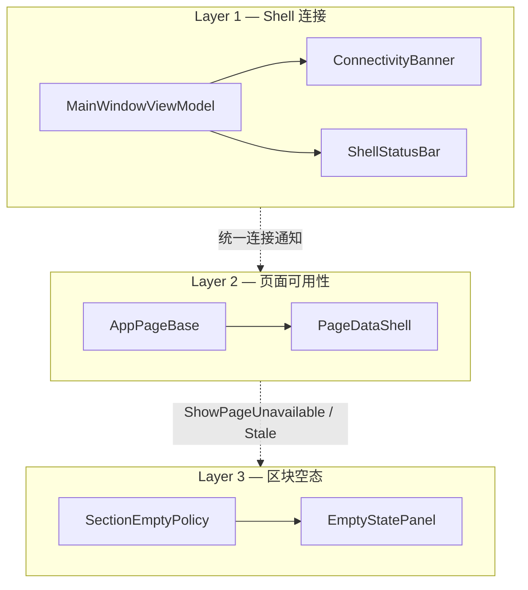

# 桌面状态模型

Avalonia Desktop（`apps/desktop-avalonia`）分别管理全局数据库连接、页面数据可用性和区块空状态。三层状态具有不同所有者和展示范围，不应合并为单一 `IsBusy`，也不应重复显示相同故障。

相关实现：`apps/desktop-avalonia/src/ViewModels/AppPageBase.cs`、`Controls/PageDataShell.axaml`、`Services/Presentation/ConnectivityBanner.cs`、`Services/Presentation/PageReconnectPolicy.cs`。

## 三层职责

| 层         | 所有者                                                                 | 呈现                                                                   | 典型状态                                                                                    |
| ---------- | ---------------------------------------------------------------------- | ---------------------------------------------------------------------- | ------------------------------------------------------------------------------------------- |
| Shell 连接 | `MainWindowViewModel`、`IDbConnectionMonitorService`、`IDbAccessGuard` | 顶栏数据库图标、侧栏数据库卡片、`ConnectivityBanner`、`ShellStatusBar` | 探测中、已知断开、访问阻断                                                                  |
| 页面可用性 | `AppPageBase`、`PageDataAvailability`                                  | `PageDataShell`（不可用状态、陈旧数据提示、加载状态）                  | `NotLoaded`、`AwaitingDatabase`、`AccessBlocked`、`Loading`、`LoadFailed`、`Stale`、`Ready` |
| 区块空态   | 各页 ViewModel、`SectionEmptyCopy`                                     | `EmptyStatePanel`                                                      | 列表或图表无数据时的标题与说明                                                              |

## Layer 1 — Shell 连接

- 连接、断开和恢复通知仅由 `MainWindowViewModel` 发出
- `ConnectivityBanner.Create` 在数据库探测期间不显示信息横幅，仅在访问阻断或确认断开时显示警告
- 数据页面不得重复提示传输层断连或访问阻断错误；统一使用 `CanToastError` 判断页面是否应显示错误

## Layer 2 — 页面可用性

### `PageDataAvailability`

| 值                               | `ShowPageUnavailable` | `IsBusy`          | 用户可见                   |
| -------------------------------- | --------------------- | ----------------- | -------------------------- |
| `NotLoaded` / `AwaitingDatabase` | 是                    | 否                | 等待数据库或首次加载许可   |
| `AccessBlocked`                  | 是                    | 否                | 版本或迁移状态阻止访问     |
| `LoadFailed`                     | 是                    | 否                | 非传输类加载失败           |
| `Loading`                        | 否                    | 是（延迟 300 ms） | 正在读取数据               |
| `Stale`                          | 否                    | 否（静默刷新）    | 断连后保留最近一次成功内容 |
| `Ready`                          | 否                    | 否                | 正常展示                   |

规则摘要：

- `IsBusy` 仅表示正在读取数据；等待数据库连接时不显示加载遮罩
- `ShowPageUnavailable` 适用于首次加载、`AccessBlocked` 和 `LoadFailed`，不适用于 `Stale`
- 已成功加载的页面在断连后进入 `Stale`，数据库恢复时执行无加载遮罩的后台刷新
- 用户主动刷新时仍显示常规加载状态
- 只读页面默认允许重连期间展示陈旧数据；设置等可写页面应将 `SupportsStaleWhileReconnect` 覆写为 `false`
- 断连与陈旧数据策略集中在 `PageReconnectPolicy`，页面不得复制相同判断

### Lookup 与 AccessGuard

`LookupCatalogService` 在访问阻断时清空缓存并返回空结果。页面通过 `OnLookupCatalogSuspended()` 清空 `DrugOptions` 等自动完成数据源，避免数据库版本不兼容时继续推荐数据库中的药品。

## Layer 3 — 区块空态

- 区块空状态统一使用 `EmptyStatePanel`，不得引入第二套并行实现
- `ShowSectionEmpty(isContentEmpty)` 决定是否显示区块空状态，展示文案由 `SectionEmptyCopy` 提供
- `AccessBlocked` 时，Shell 横幅说明全局原因，`PageDataShell` 显示页面不可用状态；列表区仍由 `ShowSectionEmpty` 控制
- 展示层级依次为 `BusyArea`、`EmptyStatePanel` 和 `DataGrid` 或其他内容

## 重载流水线

| 组件                                 | 职责                                                 |
| ------------------------------------ | ---------------------------------------------------- |
| `PageReload`                         | 保证同一页面最多执行一个有效重载任务                 |
| `PageReloadBusyDelay`                | 延迟 300 ms 显示加载状态；静默刷新不启用该延迟       |
| `AppPageBase.RunReloadPipelineAsync` | 执行访问预检、数据读取和 `PageDataAvailability` 更新 |

新数据页接入步骤见 [layering.md](./layering.md) 与 `AppPageBase.cs` 重载流水线实现。

## 反模式

- 与 `PageDataShell` 或 Shell 连接横幅并行的空状态、加载状态或重连 UI
- 页面级数据库断连通知
- 未通过 `RunReloadAsync` 和访问预检而直接调用应用服务的 `AsyncRelayCommand`
