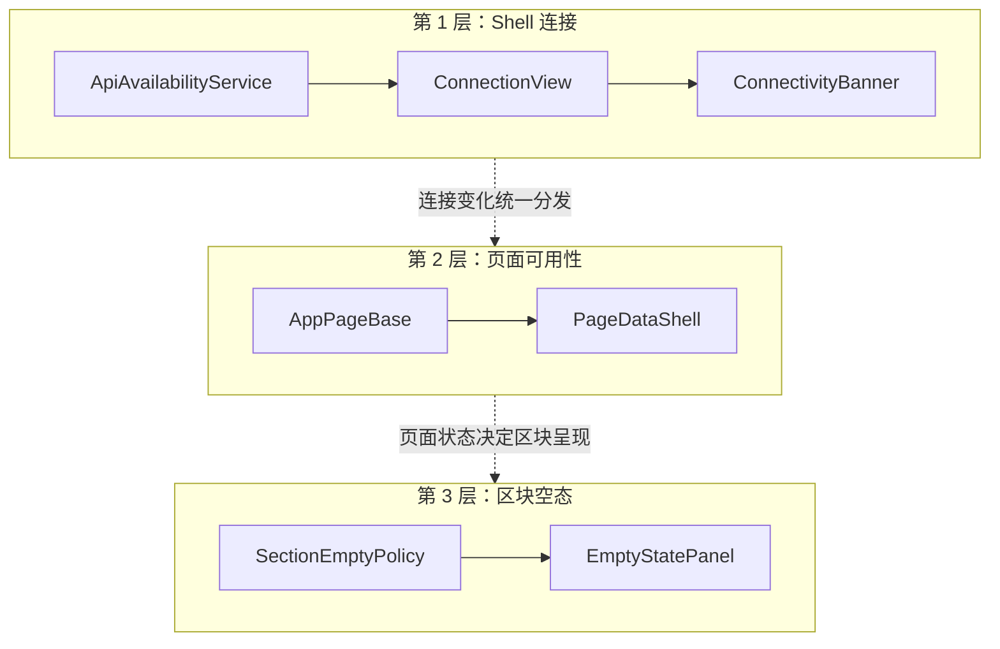

# 桌面状态模型

Avalonia 桌面端（`apps/desktop-avalonia`）把状态分成三层：Shell 连接、页面数据可用性、区块空态。Busy 表示进行中的拉数或录入类操作；断连与阻断走连接层横幅、空态 Hint，以及内容区交互锁

相关实现：`ViewModels/AppPageBase.cs`、`Controls/Feedback/PageDataShell.cs`、`Styles/Components/PageDataShell.axaml`、`Services/Presentation/Connectivity/`（`ConnectionView`、`ConnectivityBanner`、`PageReconnectPolicy`）、`Services/Infrastructure/Api/ApiAvailabilityService.cs`

## 三层职责

| 层         | 所有者                                                             | 用户可见态                                                                   |
| ---------- | ------------------------------------------------------------------ | ---------------------------------------------------------------------------- |
| Shell 连接 | `MainWindowViewModel`、`IApiAvailabilityService`、`ConnectionView` | Unknown、NotConfigured、Up、Down、Blocked                                    |
| 页面可用性 | `AppPageBase`、`PageDataAvailability`                              | NotLoaded、AwaitingService、AccessBlocked、Loading、LoadFailed、Stale、Ready |
| 区块空态   | 各页 ViewModel、`SectionEmptyCopy`                                 | 列表或图表无数据时的标题与说明                                               |

探测枚举（`Connecting`、`Ready`、`Unavailable`、`ContractBlocked`、`ServerDatabaseBlocked`、`SchemaBlocked`）只写日志，且仅已配置 PacAPI 时才探测。未配置时 `ConnectionView` 为 `NotConfigured`。页面与 Busy 只认 `ConnectionView`

## 第 1 层：连接

业务横幅、顶栏/底栏、刷新能否点、Lookup 清空都跟 `ConnectionView`。页面只认 PacAPI 可用性。PacAPI 地址、访问密钥与 Agents 密钥在设置的「连接设置」持久化

保存 PacAPI 配置后立即清除已有探测结果；新配置首检完成前为 Unknown

| 条件                                                           | ConnectionView |
| -------------------------------------------------------------- | -------------- |
| 未配置 BaseUrl 与 ApiKey                                       | NotConfigured  |
| 已配置，首检未完成                                             | Unknown        |
| Ready                                                          | Up             |
| Unavailable，进程或地址不通                                    | Down           |
| 服务端库不通（含结构读失败）                                   | Down           |
| contract 不兼容，或 schema `incompatible` / `metadata_missing` | Blocked        |

「API 进程在、库不在」对业务页是 Down，与进程不可达使用相同的等待或陈旧数据状态。协议或 schema 元数据不兼容时为 Blocked

探测策略（未配置时不进入）：

- Up：约 1s 只请求 `/v1/system/status`
- Down 或 Blocked（非密钥、非限流）：约 2s 全量再探（info 与 status；非 Ready 时先检查协议）
- 换票 401/403：挂起自动探测，只盯 `ConfigEpoch`；保存配置后再探。手动探测不受该挂起约束
- 换票 429：按 `Retry-After`（缺省约 60s）暂停探测；保存配置后解除
- 可用性探测走独立 `pac-api-availability` HttpClient，不走业务 GET Resilience
- `Start()` 自行启动轮询环；单次探测在 `_probeGate` 内串行
- 未配置：保持空闲，约 2s 后重新检查配置

## 第 2 层：页面可用性

页面共用 `SyncPageAvailability`，用 `ConnectionView` 判定通 / 不通 / AccessBlocked。Down 从未加载时走 `AwaitingService`

| 条件                            | 可用性                             | `ShowPageUnavailable` | 加载呈现                  |
| ------------------------------- | ---------------------------------- | --------------------- | ------------------------- |
| 已配置且首检未完成              | `NotLoaded`                        | 否                    | 连接检查空态              |
| Blocked                         | `AccessBlocked`                    | 是                    | 无 Busy                   |
| Down 且从未加载                 | `AwaitingService`                  | 否                    | 无 Busy                   |
| Down 且已加载且允许陈旧         | `Stale`                            | 否                    | 保留已有内容，交互禁用    |
| Up 且已加载                     | 立刻 `Ready`，随后静默刷新         | 否                    | 保留已有内容              |
| Up 且从未加载                   | 开始拉取；手动刷新时进入 `Loading` | 否                    | 各区块 `IsSectionPending` |
| 非传输错误导致拉取失败          | `LoadFailed`                       | 是                    | 无 Busy                   |
| 手动刷新正在拉取                | `Loading`                          | 否                    | 300ms 后显示对应 Busy     |
| 业务请求传输失败，探测仍可能 Up | `AwaitingService` 或 `Stale`       | 否                    | 无 Busy                   |

Shell 收到 `Changed` 后先更新连接呈现，再通过 `SyncConnection` 同步页面。连接变成 Up 时，`ScheduleAutoRefresh` 静默刷新当前页；Down 不进入 `Loading`。连接不是 Up 时，共享敏感操作立即锁定

watermark 把对应页标脏；刷新成功后仅当期间未再 Mark 才清除。脏页重新激活时正常拉取数据，超过 300ms 才显示 Busy。探测为 Down 时等待 Shell 通知恢复；探测仍为 Up 的传输失败按退避时间重试。客户端名单与分布图随脏页、自动重载和别名重拉；分布图还随日期与药品范围变化重拉

断连或阻断时，内容区由 `PageDataShell` 遮罩锁定；已有内容（若有）仍可见

### IsBusy

- Busy 只来自重载与局部 Busy 路径（含与重载互斥、不进入 `Loading` 的录入路径）
- `IsSectionPending` 只在服务可用且首个数据结果尚未返回时为真，各数据区块再叠加自己的局部 Busy
- `IsSignalReload` 不亮 Busy，也不把页面标成 `Loading`
- 进入等待 / Stale / AccessBlocked / LoadFailed 时不亮 Busy

顶栏刷新更新当前页主数据面；Busy 由各页 `BusyArea` 呈现。`PageDataShell` 只负责访问阻断空态与交互遮罩

### Lookup

`LookupCatalogService` 在 Blocked 时由 Shell 清空

## 第 3 层：区块空态

- `EmptyStatePanel` 只负责空态与内容切换；`ShowSectionEmpty` 决定是否为空，`SectionEmptyCopy` 提供文案
- 标题用各区块 `readyTitle`；等待 / Stale / 阻断 / 失败原因放 Hint
- Ready 且无数据：Hint 用各区块 `readyHint`
- Stale：有内容时不以空态盖住；内容空则用 Stale Hint
- 区块 `BusyArea` 负责加载遮罩，`EmptyStatePanel` 不判断加载状态。连接首检显示空态，开始首刷后各区块显示 Busy
- `DeferredGridSlot` 挂载前由骨架撑开高度
- 总览 Busy 只跟拉数。录入 / 事务 / 异常 Tab 在已有数据但网格未挂时也亮该区 Busy

## 重载流水线

| 组件                                 | 职责                                    |
| ------------------------------------ | --------------------------------------- |
| `PageReload`                         | 同一页面最多一个有效重载                |
| `PageReloadBusyDelay`                | 延迟 300 ms；静默刷新不启用             |
| `AppPageBase.RunReloadPipelineAsync` | 预检、拉数、更新 `PageDataAvailability` |

新数据页见 [layering.md](./layering.md) 与 `AppPageBase.cs`
