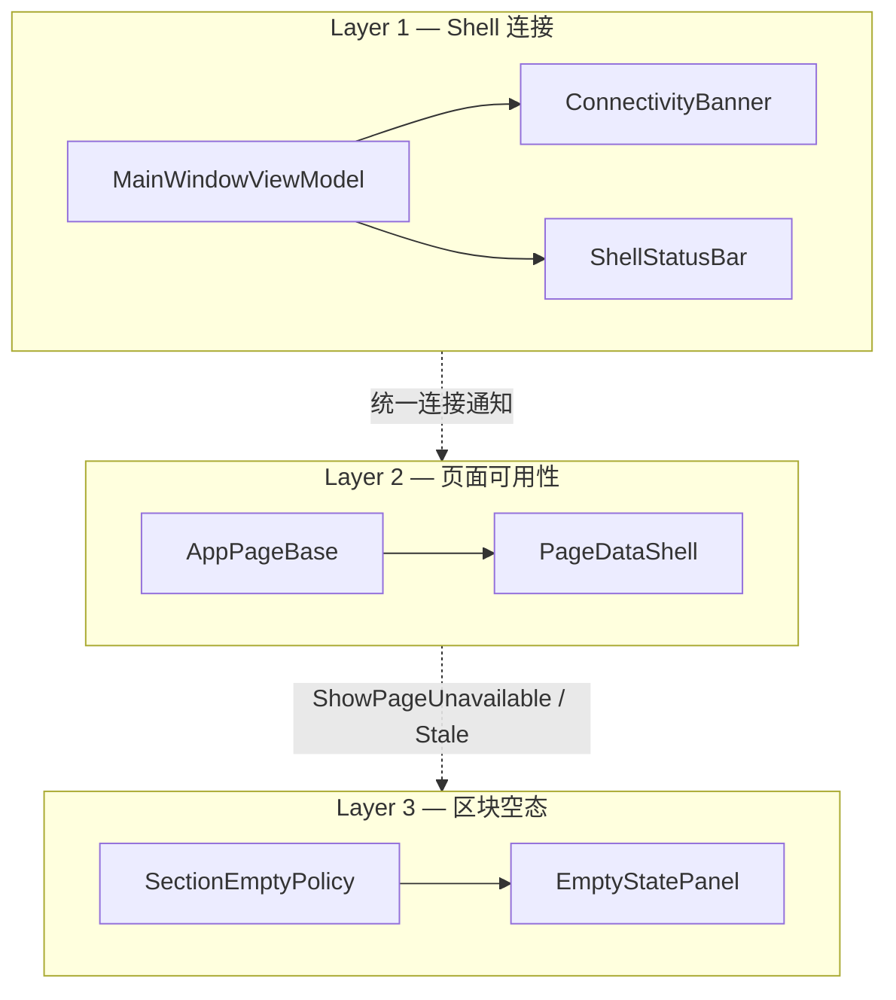

# 桌面状态模型

Avalonia Desktop（`apps/desktop-avalonia`）把全局数据库连接、页面数据可用性、区块空态分三层管。各层职责与展示范围不同，不要收成一个 `IsBusy`，也不要同一故障提示两遍。

相关实现：`apps/desktop-avalonia/src/ViewModels/AppPageBase.cs`、`Controls/Feedback/PageDataShell.axaml`、`Services/Presentation/Connectivity/ConnectivityBanner.cs`、`Services/Presentation/Connectivity/PageReconnectPolicy.cs`。

## 三层职责

| 层         | 所有者                                                                 | 呈现                                                                   | 典型状态                                                                                                       |
| ---------- | ---------------------------------------------------------------------- | ---------------------------------------------------------------------- | -------------------------------------------------------------------------------------------------------------- |
| Shell 连接 | `MainWindowViewModel`、`IDbConnectionMonitorService`、`IDbAccessGuard` | 顶栏数据库图标、侧栏数据库卡片、`ConnectivityBanner`、`ShellStatusBar` | 探测中、已知断开、访问阻断                                                                                     |
| 页面可用性 | `AppPageBase`、`PageDataAvailability`                                  | `PageDataShell`（不可用状态、陈旧数据提示、加载状态）                  | `NotLoaded`、`AwaitingDatabase`、`AwaitingService`、`AccessBlocked`、`Loading`、`LoadFailed`、`Stale`、`Ready` |
| 区块空态   | 各页 ViewModel、`SectionEmptyCopy`                                     | `EmptyStatePanel`                                                      | 列表或图表无数据时的标题与说明                                                                                 |

## Layer 1 — Shell 连接

- 连接、断开和恢复通知仅由 `MainWindowViewModel` 发出
- `ConnectivityBanner.Create` 在数据库探测期间不显示信息横幅，仅在访问阻断或确认断开时显示警告
- 数据页面不得重复提示传输层断连或访问阻断错误；统一使用 `CanToastError` 判断页面是否应显示错误

## Layer 2 — 页面可用性

### `PageDataAvailability`

| 值                               | `ShowPageUnavailable` | `IsBusy`          | 用户可见                          |
| -------------------------------- | --------------------- | ----------------- | --------------------------------- |
| `NotLoaded` / `AwaitingDatabase` | 是                    | 否                | 等待本机数据库或首次加载许可      |
| `AwaitingService`                | 仅首次加载            | 否                | 等待 API 等远端服务；定时静默重试 |
| `AccessBlocked`                  | 是                    | 否                | schema 或访问门禁阻止访问         |
| `LoadFailed`                     | 是                    | 否                | 非传输类加载失败                  |
| `Loading`                        | 否                    | 是（延迟 300 ms） | 正在读取数据                      |
| `Stale`                          | 否                    | 否（静默刷新）    | 断连或服务不可用后保留最近内容    |
| `Ready`                          | 否                    | 否                | 正常展示                          |

规则摘要：

- `IsBusy` 仅表示正在读取数据；等待数据库或服务时不显示加载遮罩
- `ShowPageUnavailable` 适用于首次加载、`AccessBlocked` 和 `LoadFailed`，不适用于 `Stale`
- 本机库断开：首次加载进 `AwaitingDatabase`；已有缓存进 `Stale`，库恢复后后台刷新
- 远端 API 瞬时失败：首次加载进 `AwaitingService`；已有缓存进 `Stale`，定时静默重试；不要 Signal DB monitor
- 远端只读页覆写 `RequiresLocalDbForReload = false`：跳过本机 Pg 门禁，不订阅 DB monitor；空态与 toast 按服务语义（见 `CanPageFromDb`、`CanToastError`）
- 服务重试挂在页面生命周期：离开即取消；回到页面时，若仍是 `AwaitingService`，或已挂服务截止的 `Stale`（含本机页 PacApi 失败），再续排。只有库断、没有服务截止的 `Stale` 等 DB reconnect。Dispose 后不再重试
- `SyncPageAvailability` 与取消重载时，不要因为本机库连断就改掉 `AwaitingService`，也不要清掉已挂服务截止的降级态。非静默重试做到一半被取消、正停在 `Loading` 时，按是否已加载过回到 `AwaitingService` 或 `Stale`。库恢复后若服务截止还在，续排重试
- 本机 Pg 传输出错按异常类型进库断可用性；不要等 `Signal` 探完才改页面状态
- 本机页因 PacApi 降级进 `Stale` 时，横幅用服务文案与图标，不要写成「数据库已断开」
- 用户主动刷新时仍显示常规加载状态
- 只读页面默认允许重连期间展示陈旧数据；设置等可写页面应将 `SupportsStaleWhileReconnect` 覆写为 `false`
- 断连与陈旧数据策略集中在 `PageReconnectPolicy`，页面不得复制相同判断

### Lookup 与 AccessGuard

`LookupCatalogService` 在访问阻断时清空缓存并返回空结果。页面通过 `OnLookupCatalogSuspended()` 清空 `DrugOptions` 等自动完成数据源，避免数据库版本不兼容时继续推荐数据库中的药品。

## Layer 3 — 区块空态

- 区块空状态统一使用 `EmptyStatePanel`，不得引入第二套并行实现
- `ShowSectionEmpty(isContentEmpty)` 决定是否显示区块空状态，展示文案由 `SectionEmptyCopy` 提供
- `AccessBlocked` 时，Shell 横幅说明全局原因，`PageDataShell` 显示页面不可用状态；列表区仍由 `ShowSectionEmpty` 控制
- 展示层级依次为 `BusyArea`、`EmptyStatePanel` 和 `DataGrid` 或其他内容

## 重载流水线

| 组件                                 | 职责                                                 |
| ------------------------------------ | ---------------------------------------------------- |
| `PageReload`                         | 保证同一页面最多执行一个有效重载任务                 |
| `PageReloadBusyDelay`                | 延迟 300 ms 显示加载状态；静默刷新不启用该延迟       |
| `AppPageBase.RunReloadPipelineAsync` | 执行访问预检、数据读取和 `PageDataAvailability` 更新 |

新数据页接入步骤见 [layering.md](./layering.md) 与 `AppPageBase.cs` 重载流水线实现。

## 反模式

- 与 `PageDataShell` 或 Shell 连接横幅并行的空状态、加载状态或重连 UI
- 页面级数据库断连通知
- 未通过 `RunReloadAsync` 和访问预检而直接调用应用服务的 `AsyncRelayCommand`
