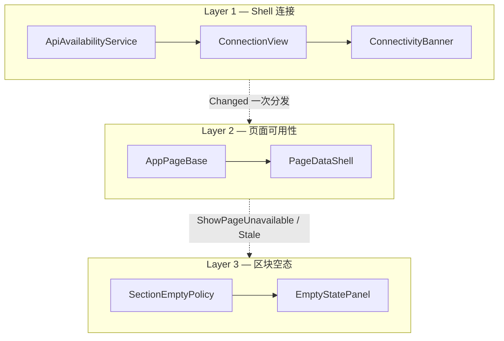

# 桌面状态模型

Avalonia Desktop（`apps/desktop-avalonia`）把状态分成三层：Shell 连接、页面数据可用性、区块空态。Busy 只表示正在拉数；断连与阻断由连接层与空态 Hint 表达，不与 Busy 叠成同一条故障

相关实现：`ViewModels/AppPageBase.cs`、`Controls/Feedback/PageDataShell.axaml`、`Services/Presentation/Connectivity/`（`ConnectionView`、`ConnectivityBanner`、`PageReconnectPolicy`）、`Services/Infrastructure/Api/ApiAvailabilityService.cs`

## 三层职责

| 层         | 所有者                                                             | 用户可见态                                                                                     |
| ---------- | ------------------------------------------------------------------ | ---------------------------------------------------------------------------------------------- |
| Shell 连接 | `MainWindowViewModel`、`IApiAvailabilityService`、`ConnectionView` | Unknown / NotConfigured / Up / Down / Blocked                                                  |
| 页面可用性 | `AppPageBase`、`PageDataAvailability`                              | NotLoaded、AwaitingDatabase、AwaitingService、AccessBlocked、Loading、LoadFailed、Stale、Ready |
| 区块空态   | 各页 ViewModel、`SectionEmptyCopy`                                 | 列表或图表无数据时的标题与说明                                                                 |

探测枚举（`Connecting` / `Ready` / `Unavailable` / `ContractBlocked` / `ServerDatabaseBlocked` / `SchemaBlocked`）只写日志，且仅已配置 PacApi 时才探测。未配置时 `ConnectionView` 为 `NotConfigured`。页面与 Busy 只认 `ConnectionView`

## Layer 1 — 连接

业务横幅、顶栏/底栏、刷新门禁、Lookup 清空都跟 `ConnectionView`。本机 `IDbConnectionMonitorService` / `IDbAccessGuard` 只服务 Settings，不进业务连接指示。PacApi 地址与密钥在设置的「连接设置」持久化

| 条件                                                           | ConnectionView |
| -------------------------------------------------------------- | -------------- |
| 未配置 BaseUrl+ApiKey                                          | NotConfigured  |
| 已配置，首检未完成                                             | Unknown        |
| Ready                                                          | Up             |
| Unavailable / 进程或地址不通                                   | Down           |
| 服务端库不通（含结构读失败）                                   | Down           |
| contract 不兼容，或 schema `incompatible` / `metadata_missing` | Blocked        |

「API 进程在、库不在」对业务页是 Down，与进程不可达同一条等待/陈旧路径。硬不兼容（协议或 schema 元数据）是 Blocked

探测策略（未配置时不进入）：

- Up：约 1s 只请求 `/v1/system/status`
- Down / Blocked（非密钥/限流）：约 2s 全量再探（info + status；非 Ready 时先检协议）
- 换票 401/403：挂起自动探测，只盯 `ConfigEpoch`；设置保存热更新后再探。手动探测不受该挂起约束
- 换票 429：按 `Retry-After`（缺省约 60s）暂停探测；配置热更新解除
- 可用性探测走独立 `pac-api-availability` HttpClient，不经业务 GET Resilience
- `Start()` 自行启动轮询环；单次探测在 `_probeGate` 内串行
- 未配置：idle，约 2s 再看是否已配置

## Layer 2 — 页面可用性

本机页与 PacApi 页共用 `SyncPageAvailability`。PacApi 页用 `ConnectionView` 判定通 / 不通 / AccessBlocked；`AwaitingService` 与 `AwaitingDatabase` 政策相同，文案键不同

| 条件                               | 可用性                                 | `ShowPageUnavailable` | `IsBusy`           |
| ---------------------------------- | -------------------------------------- | --------------------- | ------------------ |
| Blocked                            | `AccessBlocked`                        | 是                    | 否                 |
| Down 且从未加载                    | `AwaitingService` / `AwaitingDatabase` | 否                    | 否                 |
| Down 且已加载且允许陈旧            | `Stale`                                | 否                    | 否                 |
| Up 且已加载                        | 立刻 `Ready`，再静默刷新               | 否                    | 否                 |
| Up 且从未加载                      | 进入 fetch；仅手动刷新才 `Loading`     | 否                    | 仅手动且超过 300ms |
| 非传输 fetch 失败                  | `LoadFailed`                           | 是                    | 否                 |
| 正在手动拉数                       | `Loading`                              | 否                    | 是（延迟 300ms）   |
| PacApi 页传输失败（探测仍可能 Up） | 等待 / Stale                           | 否                    | 否                 |

Shell `Changed` 先更新连接呈现，再 `SyncConnection`（写入快照后 `SyncPageAvailability`）。Settings 直接 `SyncPageAvailability`。变成 Up 时对当前页 `ScheduleAutoRefresh`（silent）。Down 时不进 `Loading`

切到脏页走拉数 Busy（300ms）。PacApi 页：探测 Down 时不自排重试（等 Shell becameUp）；探测仍 Up 的传输失败可自排退避重试。本机页对 PacApi 传输错误仍可自排重试

筛选栏（`FilterBarChrome`）、药品/库存标题搜索与分页器均跟 `CanPage`：Down / Blocked / 未配置时禁用

### IsBusy

- 只有 `PageReloadBusyDelay` / `RunLocalReloadAsync(setBusy)` / `RunLocalBusyAsync` 能把 Busy 置真
- `reloadFromSignal` 不置 Busy、不把可用性标成 `Loading`（用户切到脏页除外）
- 进入等待 / Stale / AccessBlocked / LoadFailed 时 Busy 为假

`IsSectionPending` 仅 `Loading && !hasLoadedOnce`。等待连接走 EmptyState Hint。网格未挂上只在可拉数的首次进入才 pending

### Lookup 与 AccessGuard

`LookupCatalogService` 在 Blocked 时由 Shell 清空。本机 AccessGuard 仅约束 Settings

## Layer 3 — 区块空态

- 空态容器：`EmptyStatePanel`；开关与文案：`ShowSectionEmpty` + `SectionEmptyCopy`
- 标题用各区块 `readyTitle`；等待 / Stale / 阻断 / 失败原因放 Hint
- Ready 且无数据：Hint 用各区块 `readyHint`
- Stale：有内容时不以空态盖住；内容空则用 Stale Hint
- 展示层级：`BusyArea`、`EmptyStatePanel`、内容

## 重载流水线

| 组件                                 | 职责                                    |
| ------------------------------------ | --------------------------------------- |
| `PageReload`                         | 同一页面最多一个有效重载                |
| `PageReloadBusyDelay`                | 延迟 300 ms；静默刷新不启用             |
| `AppPageBase.RunReloadPipelineAsync` | 预检、拉数、更新 `PageDataAvailability` |

新数据页见 [layering.md](./layering.md) 与 `AppPageBase.cs`
