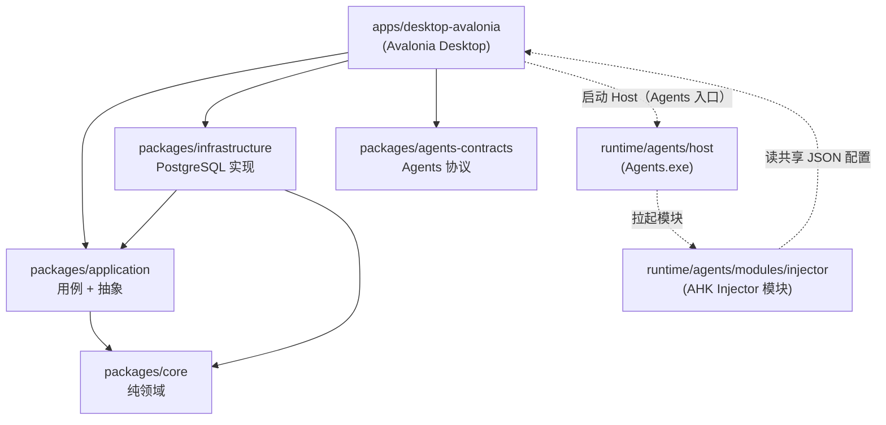

# 分层与依赖规则

重构后的 PacToolkits 将业务逻辑从 Avalonia Desktop 中逐步抽到 `packages/`，形成清晰依赖方向。

## 依赖方向



**允许：**

- Desktop → Application / Infrastructure / Agents.Contracts
- Infrastructure → Application / Core
- Application → Core

**禁止：**

- Application → Infrastructure
- Core → 任意 IO（数据库、文件系统、日志框架、配置、桌面端）
- Application / Core → Avalonia
- ViewModel 直接引用 Npgsql 或编写 SQL

## 各层职责

### `packages/core`

- 与基础设施无关的纯逻辑（例如 schema 版本比较 `DbSchemaCompat`）
- 不引用 Npgsql、Avalonia、Microsoft.Extensions.Configuration 等

### `packages/application`

- **Abstractions/**：仓储与服务接口（`IDashboardService`、`IDashboardRepo` 等）
- **DTOs/**：跨层传输模型（Dashboard、Msfx、ScanCode、Agents 等）
- **Services/**：用例实现（`DashboardService`、`ScanCodeService`、`SyncService` 等）
- 注册入口：`AddPacToolkitsApplication()`（`ServiceCollectionExtensions.cs`）

桌面 ViewModel **只注入应用服务或抽象**，不直接注入仓储实现。

### `packages/infrastructure`

- **Database/**：`PgDb`、连接监控、schema 迁移、DI 扩展
- **Repositories/**：各 `I*Repo` 的 PostgreSQL 实现
- 注册入口：`AddPacToolkitsInfrastructure()`
- 引用 Npgsql；SQL 集中在此层

### `packages/agents-contracts`

- Desktop 与 Agents 容器 / Injector 模块共享的配置与协议类型
- `AgentsOptions` / `InjectorOptions`、`AgentsConfigValidator`、`IAgentsRuntime` / `IAgentsManager`（底层契约）等
- 桌面 `AgentsRuntime` / `AgentsManager` 实现运行时控制；Host（Agents 入口进程）在 `runtime/agents/host`，AHK 模块在 `runtime/agents/modules/injector`

### `apps/desktop-avalonia`

- Views / ViewModels / Avalonia 样式与行为
- **桌面专属**服务：Toast、Dialog、更新流程、剪贴板、桌面行为（UiBehavior）等（`Services/Application`、`Services/Infrastructure`）
- 通过 DI 组装 Application + Infrastructure 层
- 页面连接/可用性/空态三层模型见 [desktop-state.md](./desktop-state.md)

## 典型请求路径（示例）

**Dashboard 加载：**

```text
DashboardViewModel
  → IDashboardService (application)
    → IDashboardRepo (abstraction)
      → DashboardRepo (infrastructure)
        → PgDb / Npgsql
```

**Agents 启停：**

```text
SettingsViewModel / MainWindowViewModel
  → IAgentsManager.GetRequired(AgentsIds.Agents)
    → IAgentsRuntime (AgentsRuntime 实现)
      → 进程启停 + AgentsConfigValidator (agents-contracts)
```

## 敏感操作与解锁

`ISensitiveUnlockService` 定义在 Application 层；实现在桌面 `SensitiveUnlockService`（依赖 Dialog / Toast 等桌面交互能力）。

## 演进约束

1. 新业务能力优先落在 Application（接口 + 服务），Infrastructure 补实现
2. Agents 相关共享类型进 `agents-contracts`，避免 Desktop 与 AHK 各写一份 JSON 模型
