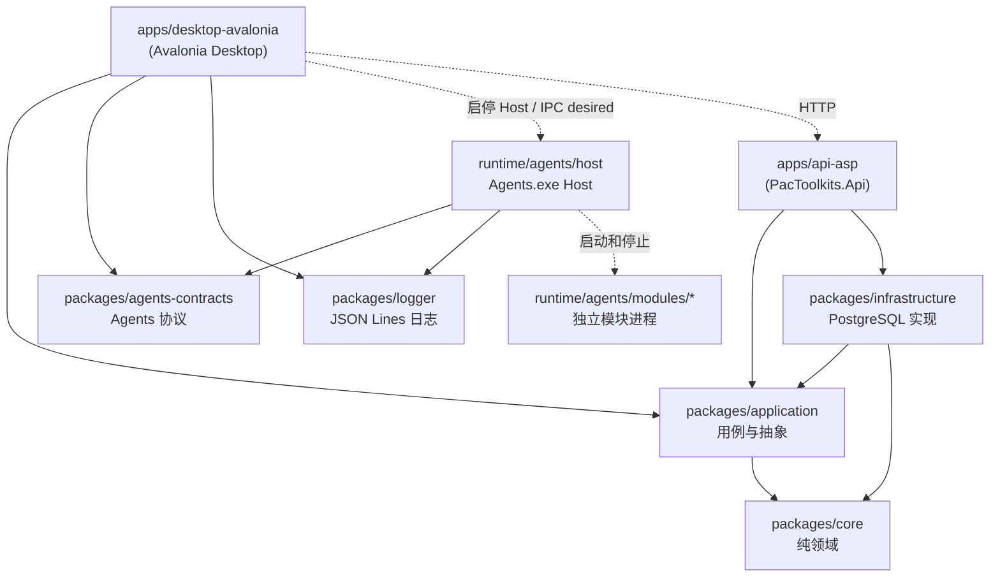

# 分层与依赖规则

PacToolkits 按 Desktop、API、Application、Infrastructure、Core、Agents.Contracts 和 Logger 划分职责。Agents Host 与模块位于 `runtime/agents/`：共享 `packages/agents-contracts`（IPC / Snapshot / 路径）；JSON Lines 走 `packages/logger`

## 依赖方向



**允许：**

- Desktop 依赖 Application、Agents.Contracts、Logger；业务数据走 HTTP 调 API
- API 依赖 Application、Infrastructure（csproj 按域路由需要引用）
- Host 依赖 Agents.Contracts、Logger
- Infrastructure 依赖 Application、Core
- Application 依赖 Core

**禁止：**

- Application 依赖 Infrastructure
- Core 依赖任意 I/O（数据库、文件系统、日志框架、配置、桌面端）
- Application、Core 依赖 Avalonia
- ViewModel 直接引用 Npgsql 或编写 SQL
- Desktop 引用 `PacToolkits.Infrastructure`、Npgsql，或注册 `AddPacToolkitsInfrastructure`
- API 依赖 Desktop / Avalonia

## 各层职责

### `packages/core`

- 与基础设施无关的纯逻辑（例如 `SemVer` / `SemVerRange` 闭区间分类；schema 分类结果见 `DbSchemaCompatibility`）
- 不引用 Npgsql、Avalonia、Microsoft.Extensions.Configuration 等

### `packages/application`

- **Abstractions/**、**DTOs/**、**Services/**：按业务域建二级目录（Dashboard、Msfx、ScanCode、Agents 等）；PacAPI 的 HTTP DTO 放在 `DTOs/Api/`
- **Diagnostics/**、**Serialization/**、**Threading/**、**TextSearch/**：跨域能力，留在顶层
- 库与 Agents 门禁：`IDbSchemaGate`（API/库 schema）、`IAgentsAdmitService`（模块 `contractVersion` 区间）、`IAgentsBundleService`（Agents 与 Desktop 版本配套）
- 注册入口：`AddPacToolkitsApplication()`（`Services/ServiceCollectionExtensions.cs`）
- public namespace 为 `.Application.Abstractions`、`.DTOs`、`.Services` 等；物理二级目录不改变对外 namespace

桌面 ViewModel **只注入应用服务或抽象**，不直接注入仓储实现。

### `packages/infrastructure`

- **Database/**：按 Connections、Configuration、Schema、ChangeFeed、Sql 等分子目录；含 `PgDb`、连接配置、DI 扩展
- **Repositories/**：按业务域分子目录（Dashboard、Msfx、ScanCode 等）
- 注册入口：`AddPacToolkitsInfrastructure()`
- public namespace 为 `.Infrastructure.Database`、`.Repositories`
- 引用 Npgsql；SQL 集中在此层

### `packages/agents-contracts`

- Desktop 与 Host 协议：路径、`module.json`、desired/status IPC、Snapshot 模型（**零依赖**）
- 运行时：`IAgentsRuntime`（Desktop UI/OS Host，**不**继承 Client）、`IAgentsClient`（管道链路）、`IAgentsManager`
- 配置校验：`AgentsOptions` / `ModuleOptions` / `AgentsConfigValidator` / `ModuleSettingsValidator`
- Host 只引用路径与协议类型；模块不引本包（命令行与文件）

进程模型见 [Agents 运行时架构](./agents.md)。

### `apps/desktop-avalonia`

- Views、ViewModels 按页面与 Shell 平行分目录；Controls、Behaviors 按用途分子目录（见 [desktop-layout.md](./desktop-layout.md)）
- 桌面专属服务落在 `Services` 下的 Infrastructure、Integration、Presentation、Workspace；PacAPI 在 `Infrastructure/Api/`，Agents Host 在 `Integration/Agents/`
- DI 入口是 `Composition/ServiceRegistration.cs` 的 `AddPacToolkitsUiServices()`；`AgentsRuntime` 负责 OS 上启停 Host、写 desired、投影 Snapshot（模块进程在 Host）
- 禁止 `Common`、`Helpers`、`Utils`、`Misc`
- 页面连接、可用性和空状态见 [desktop-state.md](./desktop-state.md)
- 焦点与工作集见 [focus-model.md](../../apps/desktop-avalonia/docs/focus-model.md)

### `apps/api-asp`

- HTTP 宿主（`PacToolkits.Api`）：按 id 配置的客户端用 API Key（散列）换 JWT 与授权策略；匿名 `/health` 探活；LISTEN 写入 SSE 变更流；域路由
- DI 组装入口：`AddPacToolkitsApi`；全量 Application 与 Infrastructure（Desktop Store 与 MSFX 客户端由宿主适配，见 [api.md](./api.md)）
- 部署与本地脚本：[API README](../../apps/api-asp/README.md)

## 典型请求路径（示例）

**Dashboard 加载：**

```text
DashboardViewModel
  IDashboardService (application)
    ApiDashboard (desktop HTTP)
      PacApiClient
        API DashboardService
          DashboardRepo (infrastructure)
            PgDb / Npgsql
```

**Agents 启停：**

```text
Settings / MainWindow shell
  IAgentsManager.GetRequired(AgentsIds.Agents)
    AgentsRuntime
      CreateProcess(Agents.exe)；quit 超时则 Kill Host 进程树
      pipe desired / Snapshot（host.desired|status 仅镜像）
      AgentsConfigValidator (agents-contracts)
```

## 敏感操作与解锁

`ISensitiveUnlockService` 在 Application；Desktop `SensitiveUnlockService` 调 PacAPI 验口令（`Auth:UnlockPasswordHash`），本机会话管空闲超时（15 分钟）、失败冷却与提示互斥。`UnlockActivity` 主窗前台输入续期，否则到期锁定

## 架构约束

1. 新业务能力优先在 Application 定义接口和服务，由 Infrastructure 提供外部系统实现
2. Desktop 与 Host 共享的 Agents 类型放入 `agents-contracts`，模块业务配置不进入 Desktop 全局配置模型
3. 新模块通过 `module.json` 声明入口、桌面元数据和构建方式，业务自动化保持在独立模块进程
4. 域数据 HTTP 只走 `apps/api-asp`：路由调 Application 用例，再进 Infrastructure。Desktop 是 HTTP 客户端。同一域禁止并行双写
