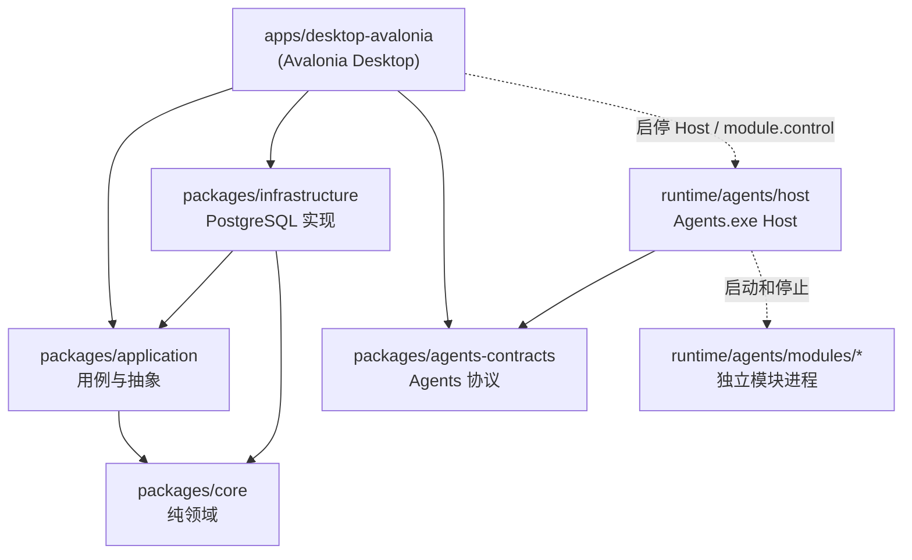

# 分层与依赖规则

PacToolkits 按 Desktop、Application、Infrastructure、Core 和 Agents.Contracts 划分职责。Agents Host 与模块位于 `runtime/agents/`，通过 `packages/agents-contracts` 与 Desktop 共享文件布局和模块描述协议。

## 依赖方向



**允许：**

- Desktop → Application、Infrastructure、Agents.Contracts
- Host → Agents.Contracts
- Infrastructure → Application、Core
- Application → Core

**禁止：**

- Application → Infrastructure
- Core → 任意 I/O（数据库、文件系统、日志框架、配置、桌面端）
- Application、Core → Avalonia
- ViewModel 直接引用 Npgsql 或编写 SQL

## 各层职责

### `packages/core`

- 与基础设施无关的纯逻辑（例如 schema 版本比较 `DbSchemaCompat`）
- 不引用 Npgsql、Avalonia、Microsoft.Extensions.Configuration 等

### `packages/application`

- **Abstractions/**：仓储与服务接口（`IDashboardService`、`IDashboardRepo` 等）
- **DTOs/**：跨层传输模型（Dashboard、Msfx、ScanCode、Agents 等）
- **Services/**：用例实现（`DashboardService`、`ScanCodeService`、`SyncService` 等）
- 注册入口：`AddPacToolkitsApplication()`（`ServiceCollectionExtensions.cs`）

桌面 ViewModel **只注入应用服务或抽象**，不直接注入仓储实现。

### `packages/infrastructure`

- **Database/**：`PgDb`、连接监控、schema 版本读取、DI 扩展
- **Repositories/**：各 `I*Repo` 的 PostgreSQL 实现
- 注册入口：`AddPacToolkitsInfrastructure()`
- 引用 Npgsql；SQL 集中在此层

### `packages/agents-contracts`

- Desktop 与 Agents（Host 和模块）共享的配置、路径与运行时抽象
- `AgentsOptions`、`ModuleOptions`、`AgentsConfigValidator`、`ModuleSettingsValidator`、`AgentsPaths`、`AgentsPath`
- `IAgentsRuntime` 和 `IAgentsManager`；Desktop 提供实现，Host 仅使用路径与协议常量
- 该包描述跨进程文件布局和模块元数据，不限定模块实现语言
- 模块通过命令行参数和文件协议参与运行时，不直接引用该 C# 包

进程模型见 [Agents 运行时架构](./agents.md)。

### `apps/desktop-avalonia`

- Views、ViewModels、Avalonia 样式与行为（ShadUI）
- **桌面专属**服务：Toast、Dialog、更新、剪贴板、UiBehavior 等
- 通过 DI 组装 Application 与 Infrastructure；`AgentsRuntime` 控制 Host 和模块
- 页面连接、可用性和空状态的分层模型见 [desktop-state.md](./desktop-state.md)

## 典型请求路径（示例）

**Dashboard 加载：**

```text
DashboardViewModel
  → IDashboardService (application)
    → IDashboardRepo (abstraction)
      → DashboardRepo (infrastructure)
        → PgDb / Npgsql
```

**Agents 启停：**

```text
Settings / MainWindow
  → IAgentsManager.GetRequired(AgentsIds.Agents)
    → AgentsRuntime
      → Process.Start(Agents.exe) + module.control / module.ready
      → AgentsConfigValidator (agents-contracts)
```

## 敏感操作与解锁

`ISensitiveUnlockService` 定义在 Application 层；Desktop 的 `SensitiveUnlockService` 提供实现，并依赖 Dialog、Toast 等桌面交互能力。解锁后按空闲超时（默认 15 分钟）自动锁定：`UnlockActivity` 在主窗前台输入时续期；后台或前台无输入则到期锁定。

## 演进约束

1. 新业务能力优先在 Application 定义接口和服务，由 Infrastructure 提供外部系统实现
2. Desktop 与 Host 共享的 Agents 类型放入 `agents-contracts`，模块业务配置不进入 Desktop 全局配置模型
3. 新模块通过 `module.json` 声明入口、桌面元数据和构建方式，业务自动化保持在独立模块进程
